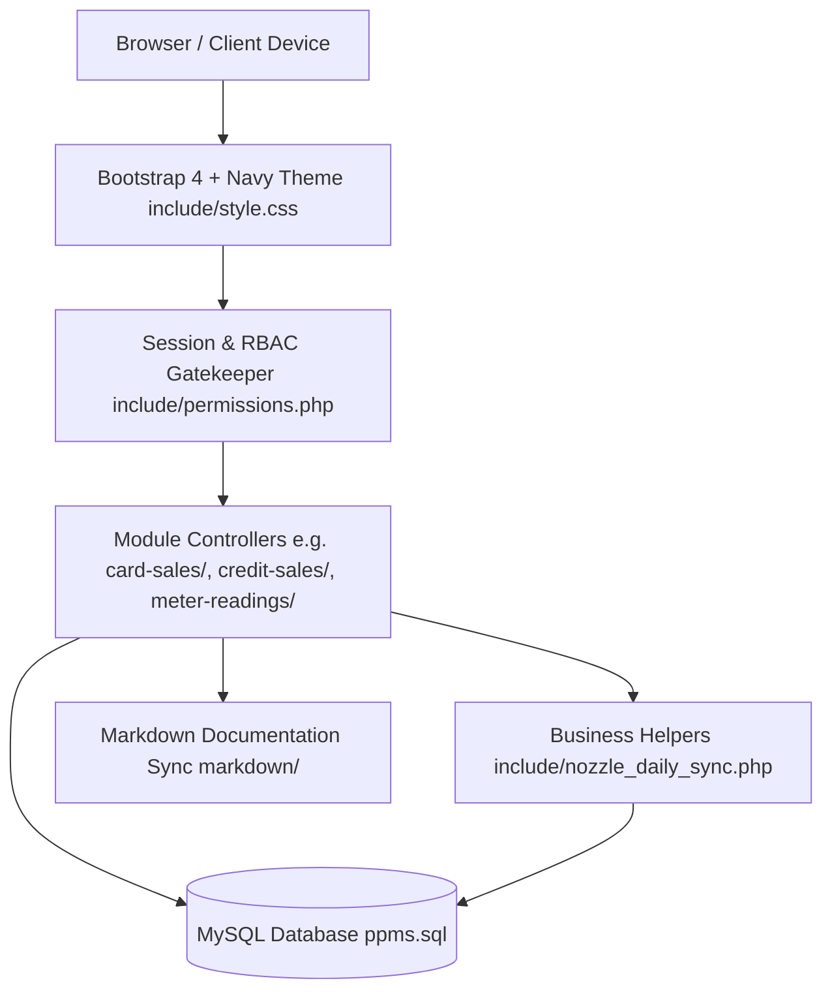
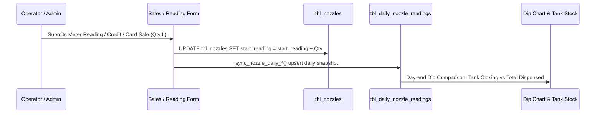
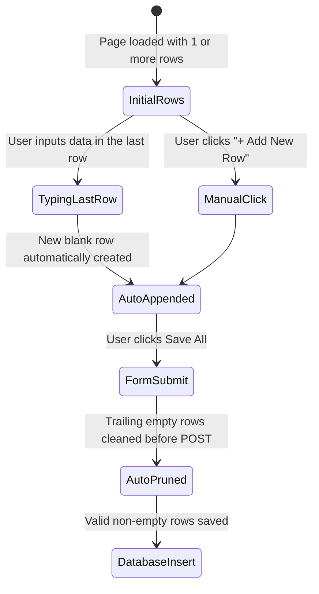

# PPMS System Architecture & Engineering Standards

> **Engineering Philosophy**: Low cognitive load, KISS (Keep It Simple, Straightforward), pragmatic DRY (Don't Repeat Yourself), self-documenting code, and zero unexpected side-effects. Code written for PPMS must be readable at a glance by any engineer with 5+ years of experience.

---

## 1. High-Level Architecture Overview

PPMS (Petrol Pump Management System) follows a **Modular Layered Architecture** powered by PHP 7.4+/8.x, MySQL/MariaDB, and a responsive Bootstrap 4 presentation layer unified by a custom deep navy design system.



### Core Architectural Layers:

| Layer | Responsibility | Key Files / Locations |
| :--- | :--- | :--- |
| **Presentation** | Responsive UI, DataTables, Navy theme, FontAwesome 5 icons | `include/style.css`, `include/navbar.php`, `theme.md`, `icon.md` |
| **Security / RBAC** | Session validation, role permissions, URL access guard | `include/session.php`, `include/permissions.php` |
| **Module Controllers** | List views, Add/Edit forms, PDF generators | `<module>/<module>-list.php`, `<module>/add-*.php` |
| **Business Logic** | Nozzle meter sync, tank dips, transaction calculation | `include/nozzle_daily_sync.php`, `include/delete*.php` |
| **Data Layer** | Schemas, soft deletion, relational foreign keys | `include/config.php`, `ppms.sql` |
| **Living Documentation** | Per-module technical specs, business rules | `markdown/*.md` |

---

## 2. Directory & File Organization Standards

To minimize cognitive load, every module follows a predictable, repeatable naming convention:

```text
ppms/
├── .agents/
│   └── AGENTS.md                  # Operational AI and coding rules
├── architecture.md                # System architecture & senior standards (this file)
├── theme.md                       # Design system color palettes & UI rules
├── icon.md                        # FontAwesome 5 icon dictionary
├── ppms.sql                       # Master database schema and baseline seed
├── include/                       # Centralized global services and shared utilities
│   ├── config.php                 # Database connection ($connection)
│   ├── session.php                # Authentication check (userloggedin())
│   ├── permissions.php            # RBAC permissions (has_permission(), check_access())
│   ├── navbar.php                 # Dynamic responsive top navigation
│   ├── style.css                  # Master CSS theme variables and responsive styles
│   ├── nozzle_daily_sync.php      # Daily meter reading and nozzle delta sync
│   └── delete<entity>.php         # Dedicated deletion & inventory rollback endpoints
├── <module-name>/                 # Standalone feature modules
│   ├── <module>-list.php          # Paginated DataTable listing with action buttons
│   ├── add-<module>.php           # Creation form (standard or multi-row spreadsheet)
│   ├── edit-<module>.php          # Modification form
│   └── generate-pdf-<module>.php  # Printable voucher or report (optional)
└── markdown/                      # Module specifications and business logic docs
    └── <module>.md                # Living documentation for each module
```

### Module Name Conventions:
- Directory names use hyphenated kebab-case: `card-machines/`, `credit-sales/`, `meter-readings/`, `dip-lookup/`.
- Corresponding permission slugs use snake_case: `card_machines`, `credit_sales`, `meter_readings`.

---

## 3. The Five Architectural Pillars

### Pillar 1: Security & Granular RBAC

Every page controller must verify authentication and authorization at the very top before rendering output:

```php
// Standard controller header (Low cognitive load pattern)
require_once __DIR__ . '/../include/session.php';
if (!userloggedin()) {
    header('Location: ../login.php');
    exit;
}
require_once __DIR__ . '/../include/config.php';
require_once __DIR__ . '/../include/permissions.php';

// Enforce permission: module slug + action ('show', 'add', 'edit', 'delete')
check_access('credit_sales', 'add');
```

#### RBAC Rules:
1. **Super Admin**: Any user with `type = 'admin'` or role name `'Admin'` automatically bypasses all permission checks (`has_permission()` returns `true`).
2. **Granular Actions**: Valid actions are `show` (or `view`), `add` (or `create`), `edit` (or `update`), and `delete`.
3. **Fallback Inheritance**: If `credit_sales` or `card_sales` permissions are unassigned, they automatically inherit rights from `meter_readings`.

---

### Pillar 2: Database Integrity & Transaction Safety

#### 1. Input Sanitization & Strict Type-Casting:
Always cast numeric inputs explicitly before constructing SQL. Never trust raw `$_POST` or `$_GET`:
```php
$id         = intval($_POST['id'] ?? 0);
$quantity   = floatval($_POST['quantity'] ?? 0.0);
$rate       = floatval($_POST['rate'] ?? 0.0);
$date_safe  = mysqli_real_escape_string($connection, trim($_POST['date'] ?? ''));
```

#### 2. Atomic Multi-Table Transactions:
When modifying multiple related tables (e.g. recording sales + advancing nozzle meters + updating daily logs), wrap the operations in a database transaction:
```php
mysqli_begin_transaction($connection);
try {
    // 1. Insert transaction record
    // 2. Update live nozzle meter
    // 3. Update daily snapshot
    mysqli_commit($connection);
} catch (Exception $e) {
    mysqli_rollback($connection);
    // Log error and report clean message
}
```

#### 3. Soft Deletion Paradigm:
Transactional records (meter readings, credit sales, card sales, expenses, invoices) **MUST NEVER** be hard deleted with `DELETE FROM`.
- Always set `deleted_at = NOW()`.
- Filter all active queries with:
  ```sql
  WHERE (deleted_at IS NULL OR deleted_at = '0000-00-00 00:00:00')
  ```

#### 4. Dual Schema Migration Protocol:
Whenever adding a new column or table:
1. Update master `ppms.sql`.
2. Add a runtime idempotent self-healing check in the relevant PHP file:
   ```php
   $check = mysqli_query($connection, "SHOW COLUMNS FROM tbl_table LIKE 'column_name'");
   if ($check && mysqli_num_rows($check) == 0) {
       mysqli_query($connection, "ALTER TABLE tbl_table ADD COLUMN column_name DECIMAL(10,2) DEFAULT 0.00");
   }
   ```

---

### Pillar 3: Fuel Inventory & Nozzle State Synchronization

Fuel pumps operate on physical mechanical/electronic totalizers. Software readings must remain strictly synchronized with physical nozzle counters.



#### Synchronous Lifecycle Rules:
1. **Adding Sales/Readings**:
   - `tbl_nozzles.start_reading` advances forward by the dispensed volume.
   - `sync_nozzle_daily_*` updates `closing_reading` and increments `dispensed_litres` in `tbl_daily_nozzle_readings`.
2. **Deleting Sales/Readings**:
   - Dispensed volume must be automatically deducted:
     ```sql
     UPDATE tbl_nozzles 
     SET start_reading = GREATEST(start_reading - $qty, 0.00) 
     WHERE id = '$nozzle_id'
     ```
   - Daily log is adjusted downward via `sync_nozzle_daily_card_sale_delta($connection, $date, $shift_id, $nozzle_id, -$qty)`.
3. **Daily Dip Reconciliation**:
   - `tbl_daily_nozzle_readings` provides opening and closing meter readings for each nozzle per date/shift, allowing daily dip tank variances to be accurately audited.

---

### Pillar 4: UI Design System & Presentation Standards

To provide a consistent, premium experience across all devices, strictly follow `theme.md` and `icon.md`:

1. **Color Palette**:
   - Primary Deep Navy: `#04204e` (`var(--primary-color)`)
   - Primary Hover Navy: `#07347a` (`var(--primary-hover)`)
   - Navy Gradient: `linear-gradient(135deg, #04204e 0%, #07347a 100%)`
   - Backgrounds: `#f8f9fa` for main content areas; `#ffffff` for cards.
2. **Typography**:
   - Primary Font: `'Roboto', sans-serif`.
3. **Buttons & Tables**:
   - `.btn-primary` and table headers (`table thead th`) must strictly use `#04204e`.
   - Never use default Bootstrap bright blue (`#007bff`).
4. **Icons**:
   - Strictly FontAwesome 5 (`fas fa-*`). Example: `fas fa-plus`, `fas fa-edit`, `fas fa-trash-alt`, `fas fa-save`, `fas fa-times`, `fas fa-gas-pump`.
5. **Responsiveness (`<= 1240px`)**:
   - All forms, tables, and navbars must adapt fluidly to laptops and tablets.
   - DataTables must use `.table-responsive` containers.

---

### Pillar 5: Spreadsheet-Style Multi-Row Form Pattern

For high-volume transaction entry (Credit Sales, Card Sales), the UI behaves like a rapid spreadsheet:



#### Key Implementation Details:
1. **Auto-Expansion**: When user enters any value in the last row of the table, append a fresh row automatically.
2. **Manual "+ Add New Row" Button**: Provided in both table header and bottom action bar.
3. **Smart Submission Pruning (`cleanEmptyRows`)**:
   - Before `form.submit()`, automatically remove any trailing rows where required inputs (e.g. quantity, amount, slip number) are blank.
   - Prevents blank/null database rows and false validation alerts.

---

## 4. Senior Developer Guidelines (Low Cognitive Load, DRY & KISS)

### 1. Keep It Simple, Straightforward (KISS)
- **No Over-Engineering**: Solve today's concrete business requirement directly and cleanly. Do not invent speculative abstractions, multi-layered inheritance chains, or unnecessary external dependencies for workflows that straightforward native PHP and standard SQL queries solve reliably.
- **Obvious Over Clever**: Code should be readable in 10 seconds. Avoid clever one-liners, deeply nested ternary expressions, or obscure magic tricks. If a simple `if` condition communicates intent better than a complex regex or nested ternary, use the simple `if`.
- **Single Responsibility**: Each controller and helper function must have one clear reason to change. Page controllers handle presentation and input routing; helpers in `include/` execute specialized domain logic.
- **Pragmatic Architecture**: Prefer proven, native, low-complexity solutions over heavy abstractions.

### 2. Don't Repeat Yourself (DRY)
- **Centralize Helpers**: If a query or calculation is used in more than one place, extract it into an `include/*.php` helper (e.g. `include/nozzle_daily_sync.php`).
- **Standard AJAX Delete**: All delete requests route to `include/delete<module>.php` with consistent parameter naming (`id` or `date`).

### 3. Low Cognitive Load Code Style
- **Flat Over Nested**: Prefer early returns (`guard clauses`) over deeply nested `if/else` ladders.
- **Explicit Variable Names**: Use `$nozzle_id`, `$slip_date`, `$unit_rate` instead of `$n`, `$d`, `$r`.
- **Page Length Budget**: Keep controller files under 350 lines. Move heavy SQL queries or reusable UI templates into modular components.

### 4. Error Handling & Feedback
- Always return clean user feedback:
  - Synchronous forms: Toast / Alert messages styled with alert-danger or alert-success.
  - AJAX endpoints: JSON format `{ "status": "success"|"error", "message": "..." }` or plain text status strings handled by SweetAlert / Bootstrap Modals.

### 5. Living Documentation Rule
Whenever a schema column, CRUD endpoint, or business workflow changes:
- Update the corresponding document in `markdown/<module>.md`.
- Keep documentation concise, focused on business logic, database tables, and API contracts.

---

## 5. Architectural Quality Checklist

Before committing any feature or refactor, verify:
- [ ] Authentication checked at top (`userloggedin()`).
- [ ] Permission enforced (`check_access($module, $action)`).
- [ ] All inputs sanitized (`intval`, `floatval`, `mysqli_real_escape_string`).
- [ ] Nozzle reading incremented on add, decremented on delete.
- [ ] Soft deletion used for transactions (`deleted_at = NOW()`).
- [ ] Master schema `ppms.sql` updated if database structure changed.
- [ ] Navy design system (`theme.md`) and FontAwesome 5 (`icon.md`) strictly respected.
- [ ] Tablet/laptop responsive layout (`<= 1240px`) verified.
- [ ] Living documentation updated in `markdown/<module>.md`.
