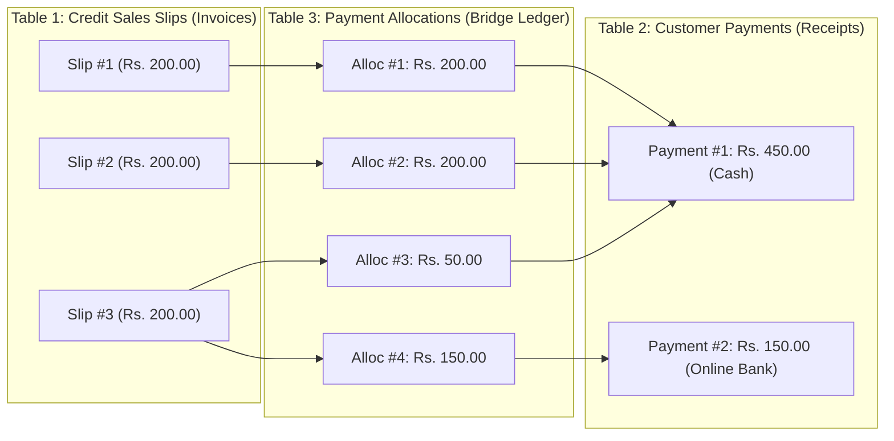

# Accounts Receivable & Credit Sale Settlement Module

The **Accounts Receivable** module (`accounts/credit-sale-receivables.php`, `accounts/payment-history.php`) provides full credit sales billing, payment collection, and multi-mode financial reconciliation for PPMS.

It guarantees strict audit integrity, partial slip payment cutting, and 100% soft-delete reversibility.

---

## 1. Why Three Tables Are Used (The Relational Architecture)

In commercial petrol pump accounting, credit sales slips and customer payments form a **Many-to-Many ($M:N$)** relationship:



### Why a Single `payment_id` on the Credit Sales Table Fails:
1. **One payment settles multiple slips**:
   - Customer pays **Rs. 450** in cash.
   - This single payment settles Slip #1 (Rs. 200), Slip #2 (Rs. 200), and partial Slip #3 (Rs. 50).
   - If we only had 1 table, we cannot store 1 receipt across 3 separate slips without duplicating payment totals.
2. **One slip is paid across multiple installments**:
   - Look at **Slip #3** (Total: Rs. 200):
     - **Installment 1**: Customer pays **Rs. 50** in cash on Sept 1st (Payment #1).
     - **Installment 2**: Customer pays remaining **Rs. 150** via Online Bank transfer on Sept 8th (Payment #2).
   - If `tbl_meter_reading_credit_sales` only had a single `payment_id` column:
     - Overwriting it with `payment_id = 2` breaks Payment #1's audit (Payment #1 loses its Rs. 50 slip).
     - Keeping it as `payment_id = 1` leaves Payment #2 with no slip attached.
3. **The 3-Table Solution**:
   - **`tbl_meter_reading_credit_sales`**: Records **what was dispensed and billed**.
   - **`tbl_customer_payments`**: Records **the master payment received** (Receipt #, Customer, Date, Total Amount, Mode, Bank/Cheque, Filter Context).
   - **`tbl_customer_payment_allocations`**: The silent ledger bridge recording **how much money from Payment X settled Slip Y**.

---

## 2. The 10 Edge Cases & System Solutions

| # | Edge Case | Business Challenge | System Solution & Protection |
|:---:|:---|:---|:---|
| **1** | **Partial Slip Cutting** *(Rs. 450 vs 200, 200, 200)* | Payment is not enough to cover the final slip (Slip #3 needs Rs. 200, only Rs. 50 left). | The allocation table records exactly **Rs. 50.00**. Slip #3 updates to `paid_amount = 50.00`, `payment_status = 'Partial'`, leaving **Rs. 150.00** due. |
| **2** | **Finishing an Already-Partial Slip** | Customer previously paid Rs. 50 on Slip #3. Next week, pays Rs. 150. | The FIFO algorithm checks `(charge_amount - paid_amount)` = $200 - 50 = \mathbf{Rs.\ 150.00}$. It allocates Rs. 150, updates `paid_amount = 200.00`, and marks status **`Paid`**. |
| **3** | **Overpayment Prevention (No Extra Pay)** | User enters Rs. 700 when the customer only owes Rs. 600. | Strict UI & server validation: Maximum allowed payment is capped at `total_due`. Overpayment is blocked with an alert: *"Amount cannot exceed outstanding balance of Rs. 600.00"*. |
| **4** | **Zero or Negative Amounts** | Accidental submission of Rs. 0 or negative numbers. | Input constrained to `min="0.01"` and server-side guard `floatval($amount) <= 0` immediately halts execution. |
| **5** | **Strict Soft Delete & Rollback** | Payment entered by mistake needs to be removed without breaking history. | Dedicated rollback endpoint `include/deletepayment.php`: Soft-deletes payment and allocations (`deleted_at = NOW()`), subtracts allocated amounts from each slip's `paid_amount`, and reverts status back to `Unpaid` or `Partial`. |
| **6** | **Concurrent / Race Condition** | Two managers open the page and submit payments on the same customer simultaneously. | Multi-table atomic MySQL transaction (`mysqli_begin_transaction`) with `FOR UPDATE` row-level locks on `tbl_meter_reading_credit_sales`. |
| **7** | **Zero-Charge / Balanced Slips** | PPMS has `Balanced Slip` (pre-paid quota draw) and settled temporary chits (Rs. 0.00). | Receivables query strictly filters `WHERE slip_type = 'Permanent Slip' AND charge_amount > 0`. Zero-rupee slips never enter receivables. |
| **8** | **Vehicle-Specific vs. Customer-Wide Payment** | Customer sends a payment specifically for Vehicle `LEA-1234`. | Filter by `vehicle_number = 'LEA-1234'`. Payment settles only slips matching that vehicle and records `filter_vehicle_number = 'LEA-1234'`. |
| **9** | **Soft-Deleted Slips Exclusion** | A slip was soft-deleted in credit sales reading. | All queries enforce `(deleted_at IS NULL OR deleted_at = '0000-00-00 00:00:00')`. |
| **10** | **Payment Mode Validation** | Payment mode requires specific auxiliary data. | - **Cash**: No bank or cheque details needed.<br>- **Online Payment**: Requires active bank from `tbl_banks` and reference.<br>- **Cheque**: Requires Cheque Number and Cheque Date. |

---

## 3. Database Schema

### Table: `tbl_customer_payments`
```sql
CREATE TABLE IF NOT EXISTS `tbl_customer_payments` (
  `id` int(11) NOT NULL AUTO_INCREMENT,
  `receipt_no` varchar(64) NOT NULL,
  `customer_id` int(11) NOT NULL,
  `payment_date` date NOT NULL,
  `total_amount` decimal(12,2) NOT NULL DEFAULT 0.00,
  `payment_mode` enum('Cash','Online Payment','Cheque') NOT NULL DEFAULT 'Cash',
  `bank_id` int(11) DEFAULT NULL,
  `transaction_ref` varchar(128) DEFAULT NULL,
  `cheque_no` varchar(64) DEFAULT NULL,
  `cheque_date` date DEFAULT NULL,
  `filter_from_date` date DEFAULT NULL,
  `filter_to_date` date DEFAULT NULL,
  `filter_shift_id` int(11) DEFAULT 0,
  `filter_vehicle_number` varchar(64) DEFAULT NULL,
  `remarks` text DEFAULT NULL,
  `created_by` int(11) DEFAULT NULL,
  `created_at` timestamp NOT NULL DEFAULT current_timestamp(),
  `updated_at` timestamp NOT NULL DEFAULT current_timestamp() ON UPDATE current_timestamp(),
  `deleted_at` datetime DEFAULT NULL,
  PRIMARY KEY (`id`),
  KEY `idx_customer` (`customer_id`),
  KEY `idx_payment_date` (`payment_date`),
  KEY `idx_bank` (`bank_id`),
  KEY `idx_deleted` (`deleted_at`)
) ENGINE=InnoDB DEFAULT CHARSET=utf8mb4 COLLATE=utf8mb4_general_ci;
```

### Table: `tbl_customer_payment_allocations`
```sql
CREATE TABLE IF NOT EXISTS `tbl_customer_payment_allocations` (
  `id` int(11) NOT NULL AUTO_INCREMENT,
  `payment_id` int(11) NOT NULL,
  `credit_sale_id` int(11) NOT NULL,
  `allocated_amount` decimal(12,2) NOT NULL DEFAULT 0.00,
  `created_at` timestamp NOT NULL DEFAULT current_timestamp(),
  `deleted_at` datetime DEFAULT NULL,
  PRIMARY KEY (`id`),
  KEY `idx_payment` (`payment_id`),
  KEY `idx_credit_sale` (`credit_sale_id`),
  KEY `idx_deleted` (`deleted_at`)
) ENGINE=InnoDB DEFAULT CHARSET=utf8mb4 COLLATE=utf8mb4_general_ci;
```

### Columns Added to `tbl_meter_reading_credit_sales`:
- `paid_amount` DECIMAL(12,2) NOT NULL DEFAULT 0.00
- `payment_status` ENUM('Unpaid', 'Partial', 'Paid') NOT NULL DEFAULT 'Unpaid'

---

## 4. Dual Balance Tracking (With vs. Without Filter)

The module simultaneously surfaces two distinct balance metrics:

```text
┌──────────────────────────────────────────────┬──────────────────────────────────────────────┐
│       CURRENT FILTER BALANCE DUE             │      CUSTOMER TOTAL LIFETIME BALANCE DUE     │
│   (e.g. Sept 2026 / Vehicle LEA-1234)        │       (All vehicles & dates across all time) │
│                 Rs. 150.00                   │                    Rs. 1,450.00              │
└──────────────────────────────────────────────┴──────────────────────────────────────────────┘
```

1. **With Filter (Current Filter Due)**:
   $$\text{Filtered Due} = \sum (\text{charge\_amount} - \text{paid\_amount}) \quad \text{within selected date/shift/vehicle}$$
2. **Without Filter (Lifetime Customer Due)**:
   $$\text{Lifetime Due} = \sum (\text{charge\_amount} - \text{paid\_amount}) \quad \text{across all open slips for this customer}$$

---

## 5. UI Layout & Search-First Workflow

1. **Top-Level Filter Bar (`accounts/credit-sale-receivables.php`)**:
   - The filter card sits at the very top directly beneath the page header.
   - Initial page load does **not** fetch or render all database slips; it renders a clean search prompt card requesting the operator to apply customer, vehicle, shift, or date criteria.
   - When filters are submitted (`$isSearched = true`), the system calculates filtered totals and renders the 4-card metric ribbon directly above the data ledger table.
2. **Clean Payment Receipts Ledger (`accounts/payment-history.php`)**:
   - Displays a clean audit table of all customer payment vouchers directly below the header.
   - Detailed modal breakdown displays exact permanent slips settled per payment.

