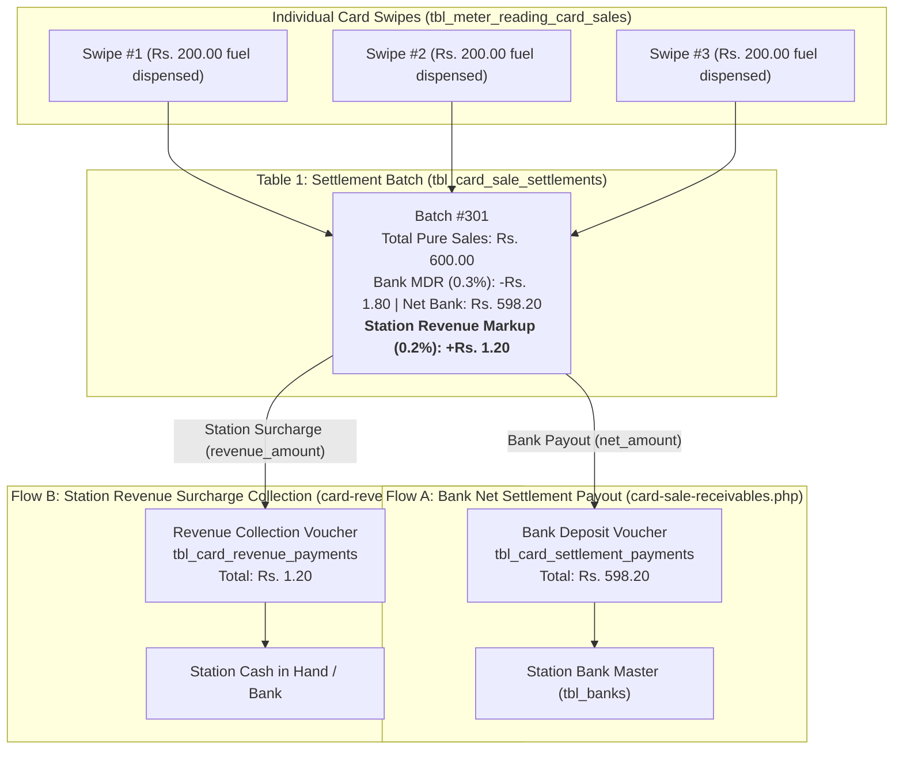

# Card Revenue Receivables Module (`markdown/card_revenue_receivables.md`)

The **Card Revenue Receivables** module (`accounts/card-revenue-receivables.php`, `accounts/card-revenue-history.php`) provides dedicated accounts receivable tracking, reconciliation, and collection for the station's internal **Card Surcharge Markup Revenue** (`revenue_amount` / `difference`).

It operates independently of commercial bank net settlement deposits, enforces strict overpayment protection, chronological FIFO allocation, rate-change snapshot integrity, and 100% reversible soft deletes.

---

## 1. Relational Architecture & Dual Flow Separation

In petrol pump accounting, card transactions on bank POS terminals involve two distinct, decoupled monetary streams:



### Why Bank Settlement & Station Revenue Are Completely Decoupled:
1. **The Bank Never Collects or Pays Station Surcharges**:
   - The commercial bank deposits purely the fuel swipe total less its agreed commission ($600.00 - 1.80 = \mathbf{Rs.\ 598.20}$).
   - The station surcharge ($0.20\% = \mathbf{Rs.\ 1.20}$) is the station's own internal markup.
2. **Independent Cash Flows & Clearance Times**:
   - The bank deposit may clear in 48 hours into Meezan Bank.
   - The revenue surcharge may be collected daily as Cash in Hand from the shift cash drawer or deposited into a separate account.
3. **Dedicated Database Columns**:
   - Bank deposit tracking: `paid_amount` & `payment_status` (`Unpaid`, `Partial`, `Paid`).
   - Revenue collection tracking: `revenue_paid_amount` & `revenue_payment_status` (`Unpaid`, `Partial`, `Paid`).
   - A batch can have its bank payout fully cleared (`payment_status = 'Paid'`) while its station revenue remains outstanding (`revenue_payment_status = 'Unpaid'`), or vice versa.

---

## 2. Benchmark Concrete Example (3 Swipes of Rs. 200.00 @ 0.20%)

### 1. Underlying Swipes in `tbl_meter_reading_card_sales`:
Three motorists swipe cards at nozzle 1:

| ID | Sale Date | Nozzle | POS Terminal | Pure Fuel Amount (`amount`) | Revenue Markup Rate | Surcharge Markup (`difference`) |
|:---:|:---:|:---:|:---:|:---:|:---:|:---:|
| **21** | 15-09-2026 | Nozzle 1 | Meezan POS | Rs. 200.00 | `0.2000%` | $200.00 \times 0.2\% = \mathbf{Rs.\ 0.40}$ |
| **22** | 15-09-2026 | Nozzle 1 | Meezan POS | Rs. 200.00 | `0.2000%` | $200.00 \times 0.2\% = \mathbf{Rs.\ 0.40}$ |
| **23** | 15-09-2026 | Nozzle 1 | Meezan POS | Rs. 200.00 | `0.2000%` | $200.00 \times 0.2\% = \mathbf{Rs.\ 0.40}$ |
| **TOTAL** | | | | **Rs. 600.00** | | **Rs. 1.20** |

$$\text{Total Pure Sales} = 200 + 200 + 200 = \mathbf{Rs.\ 600.00}$$
$$\text{Total Revenue Markup} = 0.40 + 0.40 + 0.40 = \mathbf{Rs.\ 1.20}$$

---

### 2. Settlement Batch Created in `tbl_card_sale_settlements`:
At shift end, the operator creates Batch #301 for Meezan POS:

| id | Batch # | Date | Pure Sales (`amount`) | Bank Net (`net_amount`) | Bank Paid (`paid_amount`) | Bank Status | Revenue Rate (`revenue_percentage`) | Revenue Expected (`revenue_amount`) | Revenue Paid (`revenue_paid_amount`) | Revenue Balance Due | Revenue Status |
|:---:|:---:|:---:|:---:|:---:|:---:|:---:|:---:|:---:|:---:|:---:|:---:|
| **70** | `301` | 15-09-2026 | Rs. 600.00 | Rs. 598.20 | Rs. 0.00 | `Unpaid` | **`0.2000%`** | **Rs. 1.20** | **Rs. 0.00** | **Rs. 1.20** | **`Unpaid`** |

---

## 3. How Rate Changes Are Tracked & Protected (Snapshot Architecture)

### What Happens if the Station Changes the Revenue Rate Tomorrow?
Suppose on **16-09-2026**, the station owner increases the revenue charge on Meezan POS from `0.2000%` to **`0.5000%`**:

1. **Database Snapshot Guarantee**:
   - `tbl_card_machines.revenue_charge` holds the current default rate (`0.5000%`).
   - When new card swipes occur on Sept 16th totaling **Rs. 1,000.00**, Batch #302 permanently snapshots `revenue_percentage = 0.5000%` and `revenue_amount = Rs. 5.00`.
   - Batch #301 from Sept 15th **permanently retains** `revenue_percentage = 0.2000%` and `revenue_amount = Rs. 1.20`.
2. **No Historical Retroactive Corruption**:
   - Modifying machine configuration in `tbl_card_machines` **ONLY affects future transactions**.
   - Historical receivables, outstanding balances, and audit records never change.

### Multi-Rate State Across Two Batches:
| Batch # | Date | Machine | Pure Sales | Rate Snapshot | Revenue Expected | Revenue Paid | Balance Due | Status |
|:---:|:---:|:---:|:---:|:---:|:---:|:---:|:---:|:---:|
| **301** | 15-09-2026 | Meezan POS | Rs. 600.00 | **`0.2000%`** | **Rs. 1.20** | Rs. 0.00 | **Rs. 1.20** | `Unpaid` |
| **302** | 16-09-2026 | Meezan POS | Rs. 1,000.00 | **`0.5000%`** | **Rs. 5.00** | Rs. 0.00 | **Rs. 5.00** | `Unpaid` |
| **TOTAL** | | | **Rs. 1,600.00** | — | **Rs. 6.20** | **Rs. 0.00** | **Rs. 6.20** | |

---

## 4. Date Range Collection Workflow: Knowing What Is Unreceived vs. Received

### Phase 1: Identifying What Is UNRECEIVED (Outstanding Due)
The accountant visits `accounts/card-revenue-receivables.php` and filters:
- **From Date**: `15-09-2026`
- **To Date**: `16-09-2026`
- **Card Machine**: `Meezan POS`
- **Status**: `Outstanding`

#### What the UI Displays:
1. **Summary Ribbon**:
   - **Total Received**: `Rs. 0.00` (Green)
   - **Lifetime Balance**: `Rs. 6.20` (Info Blue — total uncollected revenue owed for Meezan POS)
2. **Data Table**:
   - Batch #301: Expected `Rs. 1.20`, Paid `Rs. 0.00`, **Due: `Rs. 1.20`**, Status: `Unpaid` (Red).
   - Batch #302: Expected `Rs. 5.00`, Paid `Rs. 0.00`, **Due: `Rs. 5.00`**, Status: `Unpaid` (Red).
   - Footnote totals: Expected **Rs. 6.20**, Due **Rs. 6.20**.
3. **Action Button**:
   - Header button: **"Collect Revenue Charges (Rs. 6.20)"** is active.

---

### Phase 2: Executing Collection with a Date Range
The accountant clicks **"Collect Revenue Charges (Rs. 6.20)"**:

1. **Modal Form Input**:
   - **Collection Date**: `2026-09-18` (defaults to today)
   - **Card Machine**: `Meezan POS` (pre-filled)
   - **Settlement Period**: `15-09-2026 to 16-09-2026` (pre-filled)
   - **Destination / Payment Mode**:
     - `Cash in Hand` (station physical cash box / safe) OR
     - `Bank Account` (dropdown populated with verified accounts from `tbl_banks`)
   - **Amount to Collect**: Pre-filled with outstanding balance **`6.20`** (editable for partial collections, capped at 6.20; overpayment is blocked).
   - **Receipt Ref**: `REV-SEP1516-01`
   - **Remarks**: `Card surcharge revenue collected for 15-16 Sept batches`

2. **Atomic Multi-Table Transaction**:
   - **Table 1: Master Revenue Voucher Inserted (`tbl_card_revenue_payments`)**:
     | id | payment_date | card_machine_id | payment_mode | total_amount | filter_from_date | filter_to_date | transaction_ref |
     |:---:|:---:|:---:|:---:|:---:|:---:|:---:|:---:|
     | **1** | `2026-09-18` | `1` (Meezan) | `Cash` | **6.20** | `2026-09-15` | `2026-09-16` | `REV-SEP1516-01` |

   - **Table 2: Allocation Bridge Rows Inserted (`tbl_card_revenue_payment_allocations`)**:
     - Alloc 1: `payment_id = 1`, `settlement_id = 70` (Batch #301) $\rightarrow$ **Rs. 1.20**
     - Alloc 2: `payment_id = 1`, `settlement_id = 71` (Batch #302) $\rightarrow$ **Rs. 5.00**

   - **Table 3: Settlement Batches Updated (`tbl_card_sale_settlements`)**:
     - Batch #70: `revenue_paid_amount = 1.20`, `revenue_payment_status = 'Paid'`
     - Batch #71: `revenue_paid_amount = 5.00`, `revenue_payment_status = 'Paid'`

---

### Phase 3: Identifying What HAS BEEN RECEIVED (Cleared State)
Immediately upon submission, the UI updates:

1. **Summary Ribbon**:
   - **Total Received**: **`Rs. 6.20`** (Green)
   - **Lifetime Balance**: **`Rs. 0.00`** (All filtered batches fully cleared)
2. **Data Table**:
   - Batch #301: Paid `Rs. 1.20`, Balance Due `Rs. 0.00`, Status: **`Paid`** (Green Badge).
   - Batch #302: Paid `Rs. 5.00`, Balance Due `Rs. 0.00`, Status: **`Paid`** (Green Badge).
   - Button turns grey and disabled: *"All Filtered Revenue Collected"*.
3. **Audit History Log (`accounts/card-revenue-history.php`)**:
   - Permanently records Voucher #REV-00001 with collection date, mode, user, and total amount.
   - **"View Batches" Modal**: Shows itemized list of cleared batches.
   - **Print PDF Receipt**: Formatted A4 receipt for bookkeeping.
   - **Reversible Soft Delete**: Soft-deleting Voucher #1 automatically resets batch balances back to `Unpaid` with **Rs. 6.20** due.

---

## 5. Partial Collection Scenario (Collect Rs. 4.00 out of Rs. 6.20)

If the manager only collects **Rs. 4.00** instead of Rs. 6.20:
1. **FIFO Engine Execution**:
   - Batch #301 (Needs Rs. 1.20) $\rightarrow$ Takes **Rs. 1.20**, becomes **`Paid`** (Due: Rs. 0.00).
   - Remaining cash: $4.00 - 1.20 = \mathbf{Rs.\ 2.80}$.
   - Batch #302 (Needs Rs. 5.00) $\rightarrow$ Takes remaining **Rs. 2.80**, becomes **`Partial`** (Due: $5.00 - 2.80 = \mathbf{Rs.\ 2.20}$).
2. **UI Presentation**:
   - **Total Received**: `Rs. 4.00`
   - **Remaining Balance Due**: `Rs. 2.20`
   - Batch #301 displays green **`Paid`** badge.
   - Batch #302 displays orange **`Partial`** badge with **Due: Rs. 2.20**.
   - "Collect Revenue Charges" button remains active for the remaining **Rs. 2.20**.

---

## 6. Database Schema Reference

### Table: `tbl_card_revenue_payments` (Master Voucher)
```sql
CREATE TABLE IF NOT EXISTS `tbl_card_revenue_payments` (
  `id` INT(11) NOT NULL AUTO_INCREMENT,
  `payment_date` DATE NOT NULL,
  `card_machine_id` INT(11) NOT NULL,
  `payment_mode` ENUM('Cash', 'Bank') NOT NULL DEFAULT 'Cash',
  `bank_id` INT(11) DEFAULT NULL,
  `total_amount` DECIMAL(12,2) NOT NULL DEFAULT 0.00,
  `filter_from_date` DATE DEFAULT NULL,
  `filter_to_date` DATE DEFAULT NULL,
  `transaction_ref` VARCHAR(128) DEFAULT NULL,
  `remarks` TEXT DEFAULT NULL,
  `created_by` INT(11) DEFAULT NULL,
  `created_at` TIMESTAMP NOT NULL DEFAULT CURRENT_TIMESTAMP(),
  `updated_at` TIMESTAMP NOT NULL DEFAULT CURRENT_TIMESTAMP() ON UPDATE CURRENT_TIMESTAMP(),
  `deleted_at` DATETIME DEFAULT NULL,
  PRIMARY KEY (`id`),
  KEY `idx_machine` (`card_machine_id`),
  KEY `idx_payment_date` (`payment_date`),
  KEY `idx_bank` (`bank_id`),
  KEY `idx_deleted` (`deleted_at`)
) ENGINE=InnoDB DEFAULT CHARSET=utf8mb4 COLLATE=utf8mb4_general_ci;
```

### Table: `tbl_card_revenue_payment_allocations` (Bridge Ledger)
```sql
CREATE TABLE IF NOT EXISTS `tbl_card_revenue_payment_allocations` (
  `id` INT(11) NOT NULL AUTO_INCREMENT,
  `payment_id` INT(11) NOT NULL,
  `settlement_id` INT(11) NOT NULL,
  `allocated_amount` DECIMAL(12,2) NOT NULL DEFAULT 0.00,
  `created_at` TIMESTAMP NOT NULL DEFAULT CURRENT_TIMESTAMP(),
  `deleted_at` DATETIME DEFAULT NULL,
  PRIMARY KEY (`id`),
  KEY `idx_payment` (`payment_id`),
  KEY `idx_settlement` (`settlement_id`),
  KEY `idx_deleted` (`deleted_at`)
) ENGINE=InnoDB DEFAULT CHARSET=utf8mb4 COLLATE=utf8mb4_general_ci;
```

---

## 7. The 10 Edge Cases & System Solutions

| # | Edge Case | Business Challenge | System Solution & Protection |
|:---:|:---|:---|:---|
| **1** | **Rate Change on Terminal** | Machine revenue rate is changed from 0.20% to 0.50%. | Database snapshotting: `revenue_percentage` is frozen on each batch record. Past batches permanently retain historical rates. |
| **2** | **Partial Collection Cutting** | Manager collects Rs. 4.00 against Rs. 6.20 total. | Allocation table records exact slice (Rs. 2.80 on Batch 2). Batch updates to `Partial` leaving Rs. 2.20 due. |
| **3** | **Overpayment Prevention** | Manager attempts to enter Rs. 10.00 when only Rs. 6.20 is owed. | Form input has `max="6.20"` and server validates `amount <= total_outstanding`. Overpayment is blocked. |
| **4** | **Zero or Negative Collection** | Accidental submission of 0 or negative numbers. | Input validated with `min="0.01"` and server guard `floatval($amount) <= 0` immediately halts execution. |
| **5** | **Reversible Soft Delete** | Collection voucher entered against wrong machine or amount. | Dedicated rollback endpoint `include/deletecardrevenuepayment.php`: Soft-deletes payment and allocations (`deleted_at = NOW()`), subtracts allocated revenue from batch, and restores status. |
| **6** | **Concurrent Multi-User Access** | Two accountants try to collect revenue on the same machine simultaneously. | Multi-table atomic MySQL transaction (`mysqli_begin_transaction`) with `FOR UPDATE` row locks on `tbl_card_sale_settlements`. |
| **7** | **Cash vs. Bank Destination** | Revenue can be collected in cash or deposited into a bank. | Supported via `payment_mode` (`Cash` or `Bank`). When `Bank` is selected, an active account from `tbl_banks` is linked. |
| **8** | **Underlying Swipe Drill-Down** | Manager needs to see which fuel swipes generated the revenue. | Click **"Swipes"** on any batch: Interactive AJAX modal itemizes every card swipe with fuel amount and revenue difference. |
| **9** | **Decoupled Bank Clearing** | Bank pays net settlement while station revenue is still uncollected. | Distinct status columns: `payment_status` (bank payout) vs `revenue_payment_status` (station surcharge) operate independently. |
| **10** | **Soft-Deleted Batches Exclusion** | A batch was soft-deleted in settlements. | All queries enforce `(deleted_at IS NULL OR deleted_at = '0000-00-00 00:00:00')`. |
