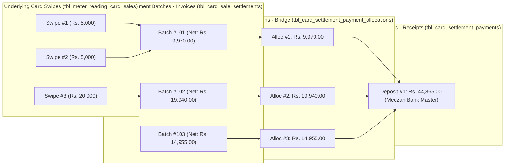

# Card Sale Receivables & Bank Settlement Module (`markdown/card_sale_receivables.md`)

The **Card Sale Receivables** module (`accounts/card-sale-receivables.php`, `accounts/card-settlement-history.php`) provides official POS bank terminal accounts receivable tracking, batch-level settlement reconciliation, and bank deposit collection into the station's Bank Master accounts (`tbl_banks`).

It operates directly on the basis of **Terminal Settlement Batches (`tbl_card_sale_settlements`)**, links directly to underlying **Individual Card Sale Swipes (`tbl_meter_reading_card_sales`)**, enforces strict overpayment protection, dual balance tracking, and 100% soft-delete reversibility.

> [!IMPORTANT]
> ### Core Architecture Rule: Bank Fee Deduction on Batch Total (Never on Individual Swipes)
> **Rule**: Bank service charges / merchant discount fees (MDR) must **strictly be deducted on the BATCH TOTAL (e.g. Total Rs. 400.00)** and **NEVER on individual swipe transactions**.
>
> - **Why?**
>   1. **Physical Pump Fuel Dispensing**: When a motorist purchases Rs. 200.00 of fuel, the dispenser nozzle pumped exactly Rs. 200.00 worth of fuel. Individual card swipe entries (`tbl_meter_reading_card_sales`) represent pure gross fuel sales (`service_charges = 0.00`, `net_amount = 200.00`). Deducting fees at the individual nozzle swipe level distorts inventory and fuel sales reconciliation.
>   2. **Commercial Banking Reality**: Acquiring commercial banks (Meezan, HBL, Bank Alfalah, etc.) never deduct MDR per swipe at the nozzle. The bank aggregates all terminal swipes and charges the fee once against the POS batch settlement payout.
>   3. **Elimination of Rounding Discrepancies**: Deducting percentage fees per swipe across dozens of transactions creates cumulative penny/paisa rounding errors that diverge from the official physical POS batch report.
>
> - **Concrete 2-Entry Benchmark**:
>   - **Swipe 1**: Rs. 200.00 $\rightarrow$ `service_charges = 0.00`, `net_amount = 200.00`
>   - **Swipe 2**: Rs. 200.00 $\rightarrow$ `service_charges = 0.00`, `net_amount = 200.00`
>   - **Batch Total Pure Sales**: $200.00 + 200.00 = \mathbf{Rs.\ 400.00}$
>   - **Bank Service Fee (e.g. 0.30%)**: $400.00 \times 0.30\% = \mathbf{Rs.\ 1.20}$ (Deducted on Total Rs. 400.00)
>   - **Net Bank Receivable**: $400.00 - 1.20 = \mathbf{Rs.\ 398.80}$

---

## 1. Why Three Tables Are Used (The Relational Architecture)

In commercial petrol pump accounting, card transactions on bank POS terminals and bank deposit payouts form a **Many-to-Many ($M:N$)** relationship across terminal settlement batches:



### Why Accounts Receivable Operates on Settlements (Not Individual Swipes):
1. **The Bank Never Settles Swipe-by-Swipe**:
   - Motorists swipe debit/credit cards at nozzles throughout the day (e.g., 50 swipes of Rs. 500, Rs. 1,000, Rs. 2,000).
   - At shift end, the operator closes the POS terminal batch and generates a **Settlement Report** (`tbl_card_sale_settlements`).
   - The commercial bank processes and deposits money into the station's bank account **per batch settlement**, deducting the agreed bank merchant discount fee.
   - Therefore, the receivable invoices owed by the bank are the **Settlement Batches** (`tbl_card_sale_settlements`), while each settlement batch provides a drill-down link to view its underlying swipes (`tbl_meter_reading_card_sales`).

2. **One Bank Payment Settles Multiple Batches**:
   - The bank frequently sends a single consolidated deposit of **Rs. 44,865.00** covering Batch #101, Batch #102, and Batch #103.
   - Without the 3-table structure, we cannot record one deposit voucher across 3 separate batches without data duplication.

3. **One Batch Settled in Installments**:
   - If a batch of Rs. 19,940.00 is settled partially (e.g. bank deposits Rs. 15,030.00 today and the remaining Rs. 4,910.00 tomorrow), the allocation table records the exact slice settled per voucher while updating `paid_amount` and `payment_status` (`Partial` $\rightarrow$ `Paid`).

4. **Service Charges Deducted On Total (NEVER on Individual Swipes)**:
   - When multiple card swipes occur (e.g. **Entry 1: Rs. 200.00**, **Entry 2: Rs. 200.00** totaling **Rs. 400.00**):
   - Individual card swipe entries represent pure gross fuel sales. **NO service fee is deducted on individual transactions**.
   - The commercial bank discount / service fee is applied and deducted **exclusively on the BATCH TOTAL (Rs. 400.00)**:
     $$\text{Total Pure Sales} = 200.00 + 200.00 = \mathbf{Rs.\ 400.00}$$
     $$\text{Bank Service Fee (e.g. 0.30\%)} = 400.00 \times 0.30\% = \mathbf{Rs.\ 1.20}$$
     $$\text{Net Settled Receivable} = 400.00 - 1.20 = \mathbf{Rs.\ 398.80}$$
   - This ensures exact reconciliation with the physical POS batch summary slip without fractional per-swipe rounding discrepancies.

---

## 2. Complete End-to-End Concrete Examples

### Common Initial Setup:
- **Card Machine / POS Terminal**: `Bank Alfalah POS` (`tbl_card_machines.id = 2`, Fee: `0.3000%`)
- **Destination Bank Master Account**: `Meezan Bank - A/C 010203040506` (`tbl_banks.id = 3`)
- **Active Filter Applied in UI**: `From Date: 15-09-2026` to `16-09-2026`, `Machine: Bank Alfalah POS`

---

### Starting State: Two Open Settlement Batches in System (`tbl_card_sale_settlements`)

| ID | Settlement Date | Machine | Batch # | Cards | Pure Sales (`amount`) | Bank Fee (`service_charges`) | Net Expected (`net_amount`) | Paid (`paid_amount`) | Balance Due | Status (`payment_status`) |
|:---:|:---:|:---:|:---:|:---:|:---:|:---:|:---:|:---:|:---:|:---:|
| **101** | 15-09-2026 | Bank Alfalah POS | `1051` | 15 | Rs. 10,000.00 | -Rs. 30.00 (0.3%) | **Rs. 9,970.00** | Rs. 0.00 | **Rs. 9,970.00** | `Unpaid` |
| **102** | 16-09-2026 | Bank Alfalah POS | `1052` | 18 | Rs. 10,000.00 | -Rs. 30.00 (0.3%) | **Rs. 9,970.00** | Rs. 0.00 | **Rs. 9,970.00** | `Unpaid` |
| **TOTAL** | | | | **33** | **Rs. 20,000.00** | **-Rs. 60.00** | **Rs. 19,940.00** | **Rs. 0.00** | **Rs. 19,940.00** | **Outstanding** |

- **Filtered Balance Due**: **Rs. 19,940.00**
- **Machine Lifetime Balance Due**: **Rs. 19,940.00**

---

### EXAMPLE 1: COMPLETE (FULL) PAYMENT (Bank Deposits Rs. 19,940.00)

The commercial bank credits the full net settlement of both batches (**Rs. 19,940.00**) into the station's Meezan Bank account on `18-09-2026`.

#### 1. What the Operator Enters in the Modal:
- **Payment Date**: `2026-09-18`
- **Card Machine**: `Bank Alfalah POS` (pre-filled)
- **Settlement Date Range**: `15-09-2026 to 16-09-2026` (pre-filled)
- **Destination Bank Account**: Selects `Meezan Bank - A/C 010203040506` (`bank_id = 3`)
- **Amount Received**: `19940.00`
- **Transaction Ref / Cheque**: `CR-ALF-889912`
- **Remarks**: `Full settlement deposit for 15-16 Sept batches`

#### 2. Table 1: Master Deposit Voucher Created (`tbl_card_settlement_payments`)
| id | payment_date | card_machine_id | bank_id | total_amount | filter_from_date | filter_to_date | transaction_ref | remarks | deleted_at |
|:---:|:---:|:---:|:---:|:---:|:---:|:---:|:---:|:---:|:---:|
| **1** | `2026-09-18` | `2` (Bank Alfalah) | `3` (Meezan Bank) | **19940.00** | `2026-09-15` | `2026-09-16` | `CR-ALF-889912` | Full deposit | `NULL` |

#### 3. Table 2: Payment Allocation Bridge Rows Created (`tbl_card_settlement_payment_allocations`)
| id | payment_id | settlement_id | allocated_amount | created_at | deleted_at |
|:---:|:---:|:---:|:---:|:---:|:---:|
| **1** | `1` | `101` (Batch #1051) | **9970.00** | `2026-09-18 20:30:00` | `NULL` |
| **2** | `1` | `102` (Batch #1052) | **9970.00** | `2026-09-18 20:30:00` | `NULL` |

#### 4. Table 3: Settlement Batches Updated (`tbl_card_sale_settlements`)
| ID | Batch # | Net Expected (`net_amount`) | Paid (`paid_amount`) | Remaining Balance Due | Status (`payment_status`) |
|:---:|:---:|:---:|:---:|:---:|:---:|
| **101** | `1051` | Rs. 9,970.00 | **Rs. 9,970.00** | **Rs. 0.00** | **`Paid`** (Green) |
| **102** | `1052` | Rs. 9,970.00 | **Rs. 9,970.00** | **Rs. 0.00** | **`Paid`** (Green) |

#### 5. Balance Management & UI Update (After Full Payment):
- **Filtered Balance Due Ribbon**: **`Rs. 0.00`**
- **Total Pure Sales**: `Rs. 20,000.00`
- **Total Received / Deposited**: `Rs. 19,940.00`
- **Machine Lifetime Balance Due**: `Rs. 0.00`
- **Receive Bank Deposit Button**: Automatically disables (`disabled="disabled"`) with tooltip: *"All filtered settlements are fully paid"*.

---

### EXAMPLE 2: HALF (PARTIAL) PAYMENT (Bank Deposits Half = Rs. 9,970.00)

Suppose the bank only credits **half** of the outstanding balance (**Rs. 9,970.00**) on `18-09-2026`, holding the second batch for the next clearing cycle.

#### 1. What the Operator Enters in the Modal:
- **Payment Date**: `2026-09-18`
- **Card Machine**: `Bank Alfalah POS`
- **Settlement Date Range**: `15-09-2026 to 16-09-2026`
- **Destination Bank Account**: `Meezan Bank - A/C 010203040506` (`bank_id = 3`)
- **Amount Received**: Operator changes the pre-filled amount to **`9970.00`**
- **Transaction Ref**: `PARTIAL-ALF-001`
- **Remarks**: `Half settlement cleared by bank`

#### 2. How the FIFO Allocation Engine Operates:
1. It queries open batches ordered chronologically by `settlement_date ASC, id ASC`:
   - First open batch: **Batch #101** (Needs Rs. 9,970.00).
   - Remaining payment funds: **Rs. 9,970.00**.
   - Allocation to Batch #101 = **Rs. 9,970.00**.
   - Remaining funds for next batch = $9,970.00 - 9,970.00 = \mathbf{Rs.\ 0.00}$.
2. Next open batch: **Batch #102** (Needs Rs. 9,970.00):
   - Available funds = **Rs. 0.00**.
   - Allocation to Batch #102 = **Rs. 0.00**.

#### 3. Table 1: Master Deposit Voucher Created (`tbl_card_settlement_payments`)
| id | payment_date | card_machine_id | bank_id | total_amount | filter_from_date | filter_to_date | transaction_ref | remarks | deleted_at |
|:---:|:---:|:---:|:---:|:---:|:---:|:---:|:---:|:---:|:---:|
| **1** | `2026-09-18` | `2` (Bank Alfalah) | `3` (Meezan Bank) | **9970.00** | `2026-09-15` | `2026-09-16` | `PARTIAL-ALF-001` | Half cleared | `NULL` |

#### 4. Table 2: Payment Allocation Bridge Created (`tbl_card_settlement_payment_allocations`)
| id | payment_id | settlement_id | allocated_amount | created_at | deleted_at |
|:---:|:---:|:---:|:---:|:---:|:---:|
| **1** | `1` | `101` (Batch #1051) | **9970.00** | `2026-09-18 20:30:00` | `NULL` |

*(Note: Batch #102 received Rs. 0.00, so zero-allocation rows are never inserted).*

#### 5. Table 3: Settlement Batches Updated (`tbl_card_sale_settlements`)
| ID | Batch # | Net Expected (`net_amount`) | Paid (`paid_amount`) | Remaining Balance Due | Status (`payment_status`) |
|:---:|:---:|:---:|:---:|:---:|:---:|
| **101** | `1051` | Rs. 9,970.00 | **Rs. 9,970.00** | **Rs. 0.00** | **`Paid`** (Green) |
| **102** | `1052` | Rs. 9,970.00 | **Rs. 0.00** | **Rs. 9,970.00** | **`Unpaid`** (Red) |

#### 6. Balance Management & UI Update (After Half Payment):
- **Filtered Balance Due Ribbon**: $0.00 + 9,970.00 = \mathbf{Rs.\ 9,970.00}$ (Remaining uncredited balance)
- **Total Pure Sales**: `Rs. 20,000.00`
- **Total Received / Deposited**: `Rs. 9,970.00`
- **Machine Lifetime Balance Due**: `Rs. 9,970.00`
- **Data Table Ledger**:
  - Batch #101 displays green badge **`Paid`** (Paid: Rs. 9,970.00, Due: Rs. 0.00).
  - Batch #102 displays red badge **`Unpaid`** (Paid: Rs. 0.00, Due: Rs. 9,970.00).
- **Receive Bank Deposit Button**: Remains **active and clickable**. When clicked, its amount field automatically pre-fills with the remaining balance of **`Rs. 9,970.00`**.

---

### EXAMPLE 2B: UNEVEN PARTIAL PAYMENT CUTTING ACROSS A BATCH

What if the bank deposits **Rs. 15,000.00** out of the Rs. 19,940.00 total due?

1. **FIFO Allocation**:
   - **Batch #101** (Needs Rs. 9,970.00):
     - Takes **Rs. 9,970.00** $\rightarrow$ `paid_amount = 9970.00`, status updates to **`Paid`** (Balance Due: **Rs. 0.00**).
     - Remaining cash: $15,000.00 - 9,970.00 = \mathbf{Rs.\ 5,030.00}$.
   - **Batch #102** (Needs Rs. 9,970.00):
     - Takes remaining **Rs. 5,030.00** $\rightarrow$ `paid_amount = 5030.00`, status updates to **`Partial`** (Orange).
     - Remaining Balance Due on Batch #102: $9,970.00 - 5,030.00 = \mathbf{Rs.\ 4,940.00}$.

2. **Allocations Bridge Rows Created**:
   - Allocation 1: `payment_id = 1`, `settlement_id = 101`, `allocated_amount = 9970.00`
   - Allocation 2: `payment_id = 1`, `settlement_id = 102`, `allocated_amount = 5030.00`

3. **Balance Management**:
   - **Remaining Filtered Balance Due**: **Rs. 4,940.00**.
   - If the operator tries to enter Rs. 5,000.00 next time, the system will **reject and block** the submission with an alert: *"Amount cannot exceed outstanding balance of Rs. 4,940.00"*.
   - When the bank finally deposits the remaining **Rs. 4,940.00**, Batch #102 updates to `paid_amount = 9970.00`, status changes from `Partial` $\rightarrow$ **`Paid`**, and total due becomes **Rs. 0.00**.

---

### EXAMPLE 2C: SPECIFIC SINGLE-BATCH PARTIAL PAYMENT (Settlement: Rs. 9,940.00 | Paid: Rs. 7,940.00 | Remaining Due: Rs. 2,000.00)

Here is the exact step-by-step resolution when the first settlement batch is **Rs. 9,940.00**, but the bank only deposits **Rs. 7,940.00**:

#### Step 1: Initial State in `tbl_card_sale_settlements` (Before Payment)
The machine closes a batch yielding Rs. 9,940.00 net receivable:
| id | settlement_date | machine_id | batch_no | Pure Sales (`amount`) | Bank Fee (`service_charges`) | Net Expected (`net_amount`) | Paid (`paid_amount`) | Balance Due | Status (`payment_status`) |
|:---:|:---:|:---:|:---:|:---:|:---:|:---:|:---:|:---:|:---:|
| **1** | 18-09-2026 | 2 | `1001` | Rs. 10,000.00 | Rs. 60.00 | **Rs. 9,940.00** | **Rs. 0.00** | **Rs. 9,940.00** | **`Unpaid`** (Red) |

- **Filtered Balance Due**: **Rs. 9,940.00**
- **Total Received**: **Rs. 0.00**

---

#### Step 2: User Records Partial Deposit of Rs. 7,940.00
The operator opens the "Receive Bank Deposit" modal and enters:
- **Payment Date**: `2026-09-18`
- **Destination Bank Account**: `Meezan Bank - A/C 010203040506` (`bank_id = 3`)
- **Amount Received**: `7940.00`
- **Transaction Ref**: `PARTIAL-DEP-7940`

When the user submits, an atomic database transaction executes:

1. **Table 1: Master Deposit Voucher Inserted (`tbl_card_settlement_payments`)**:
   | id | payment_date | card_machine_id | bank_id | total_amount | filter_from_date | filter_to_date | transaction_ref | deleted_at |
   |:---:|:---:|:---:|:---:|:---:|:---:|:---:|:---:|:---:|
   | **1** | `2026-09-18` | `2` | `3` | **7940.00** | `2026-09-18` | `2026-09-18` | `PARTIAL-DEP-7940` | `NULL` |

2. **Table 2: Allocation Bridge Row Inserted (`tbl_card_settlement_payment_allocations`)**:
   | id | payment_id | settlement_id | allocated_amount | created_at | deleted_at |
   |:---:|:---:|:---:|:---:|:---:|:---:|
   | **1** | `1` | `1` | **7940.00** | `2026-09-18 20:30:00` | `NULL` |

3. **Table 3: Settlement Batch Row Updated (`tbl_card_sale_settlements`)**:
   ```sql
   UPDATE tbl_card_sale_settlements 
   SET paid_amount = paid_amount + 7940.00,
       payment_status = CASE 
           WHEN (paid_amount + 7940.00) >= net_amount THEN 'Paid'
           WHEN (paid_amount + 7940.00) > 0 THEN 'Partial'
           ELSE 'Unpaid'
       END
   WHERE id = 1;
   ```
   **Result in `tbl_card_sale_settlements`**:
   | id | Net Expected (`net_amount`) | Paid (`paid_amount`) | Dynamic Balance Due (`net - paid`) | Status (`payment_status`) |
   |:---:|:---:|:---:|:---:|:---:|
   | **1** | **Rs. 9,940.00** | **Rs. 7,940.00** | **Rs. 2,000.00** | **`Partial`** (Orange Badge) |

---

#### Step 3: How the UI & Table Present This State
- **Summary Metrics Ribbon**:
  - **Filtered Balance Due**: **`Rs. 2,000.00`** (Remaining uncredited balance)
  - **Total Received**: **`Rs. 7,940.00`**
  - **Pure Sales**: `Rs. 10,000.00`
- **Data Table Row**:
  - Row shows an orange **`Partial`** badge.
  - Column **Paid Amount**: displays `Rs. 7,940.00`.
  - Column **Balance Due**: displays `Rs. 2,000.00`.
- **Receive Bank Deposit Button**:
  - Remains **Enabled & Clickable** because `total_due = Rs. 2,000.00 > 0`.
  - When clicked, the `amount` input field automatically pre-fills with **`2000.00`**.
- **Overpayment Prevention Protection**:
  - If the user tries to type `Rs. 2,500.00`, the modal and server immediately block the transaction with an alert:
    > *"Amount (Rs. 2,500.00) cannot exceed outstanding balance of Rs. 2,000.00"*

---

#### Step 4: Subsequent Clearing of the Remaining Rs. 2,000.00
When the commercial bank later credits the remaining **Rs. 2,000.00**:
1. Operator submits the modal with **`2000.00`**.
2. **`tbl_card_settlement_payments`**: Row #2 inserted with `total_amount = 2000.00`.
3. **`tbl_card_settlement_payment_allocations`**: Row #2 inserted with `settlement_id = 1`, `allocated_amount = 2000.00`.
4. **`tbl_card_sale_settlements`**:
   - `paid_amount` updates from `7940.00` $\rightarrow$ **`9940.00`**.
   - `payment_status` updates from `Partial` $\rightarrow$ **`Paid`** (Green Badge).
   - Balance Due becomes $9,940.00 - 9,940.00 = \mathbf{Rs.\ 0.00}$.
5. **UI & Ribbon**:
   - Filtered Balance Due drops cleanly to **`Rs. 0.00`**.
   - Total Received becomes **`Rs. 9,940.00`**.
   - "Receive Bank Deposit" button turns grey and **disabled**.

---

### EXAMPLE 2D: TWO ENTRIES TOTALING RS. 400.00 (SERVICE DEDUCTED ON TOTAL 400, NEVER ON INDIVIDUAL TRANSACTIONS)

This example illustrates how PPMS handles multiple fuel card swipes (e.g. 2 swipes of Rs. 200.00 each) and reconciles the merchant fee strictly at the batch total level:

#### 1. Underling Card Swipes in `tbl_meter_reading_card_sales`:
Two motorists swipe debit/credit cards at nozzle 1:
| ID | Sale Date | Nozzle | Batch # | Trace # | Pure Amount (`amount`) | Service Fee (`service_charges`) | Net Amount (`net_amount`) |
|:---:|:---:|:---:|:---:|:---:|:---:|:---:|:---:|
| **12** | 18-09-2026 | Nozzle 1 | `4001` | `TR-101` | **Rs. 200.00** | **Rs. 0.00** | **Rs. 200.00** |
| **13** | 18-09-2026 | Nozzle 1 | `4001` | `TR-102` | **Rs. 200.00** | **Rs. 0.00** | **Rs. 200.00** |
| **TOTAL** | | | | | **Rs. 400.00** | **Rs. 0.00** | **Rs. 400.00** |

> [!IMPORTANT]
> **Key Architecture Rule**:
> - **Individual card transactions have ZERO service charges deducted** (`service_charges = 0.00`, `net_amount = amount`).
> - The motorist was billed Rs. 200.00 for fuel. The nozzle reading pumped Rs. 200.00 worth of fuel.
> - The bank does **not** charge discount fees per swipe at the pump; the fee applies to the commercial batch settlement payout.

#### 2. Settlement Batch Created in `tbl_card_sale_settlements`:
At shift end, the operator closes Batch #4001 on the POS machine (Fee rate: `0.3000%`):
1. **Total Pure Sales (`amount`)**: $200.00 + 200.00 = \mathbf{Rs.\ 400.00}$ (Sum of pure entries)
2. **Bank Service Fee (`service_charges`)**: Deducted on the **Total Rs. 400.00**:
   $$\text{Bank Fee} = 400.00 \times 0.30\% = \mathbf{Rs.\ 1.20}$$
3. **Net Bank Receivable (`net_amount`)**:
   $$\text{Net Receivable} = 400.00 - 1.20 = \mathbf{Rs.\ 398.80}$$

**Row in `tbl_card_sale_settlements`**:
| id | Machine | Batch # | Cards | Pure Sales (`amount`) | Bank Fee % | Fee Charged (`service_charges`) | Net Receivable (`net_amount`) | Paid (`paid_amount`) | Balance Due | Status |
|:---:|:---:|:---:|:---:|:---:|:---:|:---:|:---:|:---:|:---:|:---:|
| **50** | Meezan POS | `4001` | 2 | **Rs. 400.00** | `0.3000%` | **-Rs. 1.20** | **Rs. 398.80** | Rs. 0.00 | **Rs. 398.80** | `Unpaid` |

#### 3. How Accounts Receivable Resolves This:
1. **Ribbon Metrics**:
   - Total Pure Sales: **Rs. 400.00**
   - Bank Fee Charges: **-Rs. 1.20**
   - Filtered Balance Due: **Rs. 398.80**
2. **"View Swipes" Drill-Down Modal**:
   - Lists both entries showing pure amounts:
     - Entry 1: Rs. 200.00
     - Entry 2: Rs. 200.00
     - Footer: **Total Pure Swipes = Rs. 400.00**
   - Contains an informative note: *"Bank service charges are deducted on the batch total (Rs. 400.00), not on individual swipe transactions."*
3. **Recording Bank Deposit (Deposit Voucher & Allocation)**:
   - When the commercial bank credits the net funds into the station's account (`tbl_banks.id = 3` Meezan Bank):
   - **Table 1: Master Deposit Voucher (`tbl_card_settlement_payments`)**:
     | id | payment_date | card_machine_id | bank_id | total_amount | transaction_ref | remarks |
     |:---:|:---:|:---:|:---:|:---:|:---:|:---:|
     | **5** | `2026-09-18` | `2` | `3` (Meezan Bank) | **398.80** | `DEP-BATCH-4001` | Net payout for Batch #4001 |

   - **Table 2: Allocation Bridge Row (`tbl_card_settlement_payment_allocations`)**:
     | id | payment_id | settlement_id | allocated_amount | created_at |
     |:---:|:---:|:---:|:---:|:---:|
     | **5** | `5` | `50` | **398.80** | `2026-09-18 21:00:00` |

   - **Table 3: Settlement Batch Record (`tbl_card_sale_settlements`)**:
     | id | Batch # | Pure Sales (`amount`) | Bank Fee | Net Expected (`net_amount`) | Paid (`paid_amount`) | Balance Due | Status |
     |:---:|:---:|:---:|:---:|:---:|:---:|:---:|:---:|
     | **50** | `4001` | Rs. 400.00 | -Rs. 1.20 | **Rs. 398.80** | **Rs. 398.80** | **Rs. 0.00** | **`Paid`** (Green) |

   - The modal pre-fills with **Rs. 398.80** (Net Settled Amount). Once submitted, Batch #50 status updates from `Unpaid` to `Paid`, and Filtered Balance Due drops cleanly to **Rs. 0.00**.

---

### Summary Table of Balance Metrics:

| Phase | Filtered Due | Total Received | Batch #101 Status | Batch #102 Status | Overpayment Limit |
|:---|:---:|:---:|:---:|:---:|:---:|
| **Initial State** | Rs. 19,940.00 | Rs. 0.00 | `Unpaid` (Due: 9,970) | `Unpaid` (Due: 9,970) | Max deposit: Rs. 19,940.00 |
| **After Half Pay (Rs. 9,970)** | Rs. 9,970.00 | Rs. 9,970.00 | `Paid` (Due: 0.00) | `Unpaid` (Due: 9,970) | Max deposit: Rs. 9,970.00 |
| **After Full Pay (Rs. 19,940)** | Rs. 0.00 | Rs. 19,940.00 | `Paid` (Due: 0.00) | `Paid` (Due: 0.00) | Button disabled (0.00) |
| **If Soft-Deleted (Rollback)** | Rs. 19,940.00 | Rs. 0.00 | Reverts to `Unpaid` | Reverts to `Unpaid` | Full balance restored |

---

## 3. The 10 Edge Cases & System Protections

| # | Edge Case | Business Challenge | System Solution & Protection |
|:---:|:---|:---|:---|
| **1** | **Partial Batch Cutting** | Bank deposit is less than the batch net amount (e.g. Rs. 15,030 allocated against Rs. 19,940 batch). | Allocation table records exact allocated slice (**Rs. 15,030.00**). Batch updates to `paid_amount = 15030.00`, status `'Partial'`, remaining due is **Rs. 4,910.00**. |
| **2** | **Finishing an Already-Partial Batch** | Bank previously settled Rs. 15,030 on Batch #102. Next deposit covers remaining amount. | FIFO algorithm checks `(net_amount - paid_amount)` = $19,940 - 15,030 = \mathbf{Rs.\ 4,910.00}$. Allocates Rs. 4,910, sets `paid_amount = 19940.00`, status updates to **`Paid`**. |
| **3** | **Overpayment Prevention (No Extra Pay)** | Operator enters Rs. 50,000 when the bank only owes Rs. 44,865. | Strict UI & server validation: Maximum allowed deposit is capped at `total_due`. Overpayment is rejected: *"Amount cannot exceed outstanding balance of Rs. 44,865.00"*. |
| **4** | **Zero or Negative Amounts** | Accidental submission of 0 or negative numbers. | Input constrained to `min="0.01"` and server guard `floatval($amount) <= 0` immediately halts execution. |
| **5** | **Strict Soft Delete & Rollback** | Bank deposit entered against the wrong bank or wrong amount. | Dedicated rollback endpoint `include/deletecardsettlementpayment.php`: Soft-deletes payment and allocations (`deleted_at = NOW()`), subtracts allocated amounts from each batch's `paid_amount`, and resets status back to `Unpaid` or `Partial`. |
| **6** | **Concurrent / Race Condition** | Two managers attempt to record settlement deposits simultaneously on the same machine. | Multi-table atomic MySQL transaction (`mysqli_begin_transaction`) with `FOR UPDATE` row-level locks on `tbl_card_sale_settlements`. |
| **7** | **Machine-Specific Isolation** | Station has multiple POS terminals (Bank Alfalah POS, Meezan POS). | Payments are strictly isolated by `card_machine_id`. A deposit recorded on Bank Alfalah POS only settles Bank Alfalah batches. |
| **8** | **Underlying Card Sale Drill-Down** | Operator needs to verify what physical fuel sales make up a settlement batch. | Click **"View Swipes"** on any batch: An interactive modal fetches and itemizes every card swipe from `tbl_meter_reading_card_sales` for that batch (amount, nozzle, item, trace no). |
| **9** | **Soft-Deleted Batches Exclusion** | A batch settlement was deleted in card sales. | All queries enforce `(deleted_at IS NULL OR deleted_at = '0000-00-00 00:00:00')`. |
| **10** | **Destination Bank Master Linking** | Funds must be shifted into verified accounts. | Dropdown is populated exclusively with active bank accounts from **Bank Master (`tbl_banks`)**. |

---

## 4. Database Schema

### Table: `tbl_card_settlement_payments` (Master Deposit Voucher)
```sql
CREATE TABLE IF NOT EXISTS `tbl_card_settlement_payments` (
  `id` INT(11) NOT NULL AUTO_INCREMENT,
  `payment_date` DATE NOT NULL,
  `card_machine_id` INT(11) NOT NULL,
  `bank_id` INT(11) NOT NULL,
  `total_amount` DECIMAL(12,2) NOT NULL DEFAULT 0.00,
  `filter_from_date` DATE DEFAULT NULL,
  `filter_to_date` DATE DEFAULT NULL,
  `transaction_ref` VARCHAR(128) DEFAULT NULL,
  `remarks` TEXT DEFAULT NULL,
  `created_by` INT(11) DEFAULT NULL,
  `created_at` TIMESTAMP NOT NULL DEFAULT CURRENT_TIMESTAMP(),
  `updated_at` TIMESTAMP NOT NULL DEFAULT CURRENT_TIMESTAMP() ON UPDATE CURRENT_TIMESTAMP(),
  `deleted_at` DATETIME DEFAULT NULL,
  PRIMARY KEY (`id`),
  KEY `idx_machine` (`card_machine_id`),
  KEY `idx_payment_date` (`payment_date`),
  KEY `idx_bank` (`bank_id`),
  KEY `idx_deleted` (`deleted_at`)
) ENGINE=InnoDB DEFAULT CHARSET=utf8mb4 COLLATE=utf8mb4_general_ci;
```

### Table: `tbl_card_settlement_payment_allocations` (Bridge Ledger)
```sql
CREATE TABLE IF NOT EXISTS `tbl_card_settlement_payment_allocations` (
  `id` INT(11) NOT NULL AUTO_INCREMENT,
  `payment_id` INT(11) NOT NULL,
  `settlement_id` INT(11) NOT NULL,
  `allocated_amount` DECIMAL(12,2) NOT NULL DEFAULT 0.00,
  `created_at` TIMESTAMP NOT NULL DEFAULT CURRENT_TIMESTAMP(),
  `deleted_at` DATETIME DEFAULT NULL,
  PRIMARY KEY (`id`),
  KEY `idx_payment` (`payment_id`),
  KEY `idx_settlement` (`settlement_id`),
  KEY `idx_deleted` (`deleted_at`)
) ENGINE=InnoDB DEFAULT CHARSET=utf8mb4 COLLATE=utf8mb4_general_ci;
```

### Columns Added to `tbl_card_sale_settlements`:
- `paid_amount` DECIMAL(12,2) NOT NULL DEFAULT 0.00
- `payment_status` ENUM('Unpaid', 'Partial', 'Paid') NOT NULL DEFAULT 'Unpaid'

---

## 5. Dual Balance Tracking (With vs. Without Filter)

The interface displays two balance metrics simultaneously:

```text
┌──────────────────────────────────────────────┬──────────────────────────────────────────────┐
│       FILTERED OUTSTANDING BALANCE DUE       │      MACHINE LIFETIME OUTSTANDING DUE        │
│    (e.g. 15-09-2026 to 17-09-2026 Batches)   │    (All unsettled batches across all time)   │
│                 Rs. 19,865.00                │                 Rs. 85,420.00                │
└──────────────────────────────────────────────┴──────────────────────────────────────────────┘
```

1. **Filtered Balance Due**:
   $$\text{Filtered Due} = \sum (\text{net\_amount} - \text{paid\_amount}) \quad \text{within selected date range for this machine}$$
2. **Machine Lifetime Balance Due**:
   $$\text{Lifetime Due} = \sum (\text{net\_amount} - \text{paid\_amount}) \quad \text{across all open batches for this POS terminal}$$

---

## 6. UI Layout & Search-First Workflow

1. **Top-Level Filter Bar (`accounts/card-sale-receivables.php`)**:
   - Sits at the top directly below page header.
   - Filters: `From Date`, `To Date`, `Card Machine` (from `tbl_card_machines`), and `Status` (`Outstanding`, `Unpaid`, `Partial`, `Paid`, `All`).
   - Initial page load shows a prompt card: *"Please select a Card Machine and Date Range to view card receivables."*
2. **Ribbon & Data Table**:
   - On search (`$isSearched = true`), renders the streamlined 2-metric summary ribbon: **Total Received** (`border-success`) and **Lifetime Balance** (`border-info`), followed by the settlement batches data table.
   - Each row has a **"Swipes"** button opening an itemized popup of underlying card sales from `tbl_meter_reading_card_sales`.
3. **Receive Bank Deposit Modal**:
   - Single date field: **Payment Date** (defaults to today).
   - Machine name and Date Range pre-filled.
   - Destination Bank selected from **Bank Master (`tbl_banks`)**.
   - Amount Received pre-filled with Balance Due (capped).
   - Transaction reference and remarks.
4. **Audit History (`accounts/card-settlement-history.php`)**:
   - Lists all bank deposit vouchers with single payment date, destination bank, machine, amount, and date range.
   - Detailed modal breakdown showing allocated settlement batches per deposit.
   - Print PDF receipt link.
   - Soft-delete rollback button.
