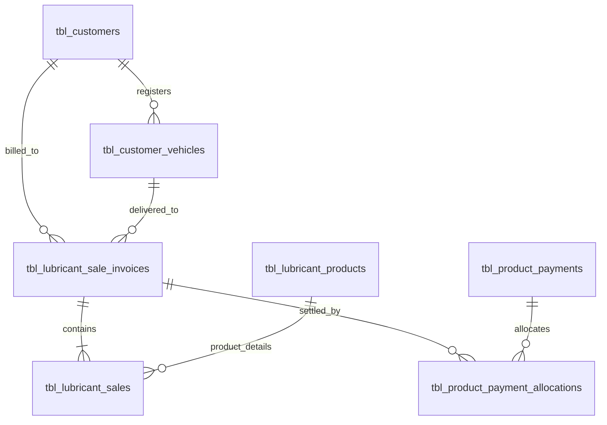

# Customer Product Credit & Lubricant Ledger Report (`markdown/customer_product_report.md`)

## 1. Overview

The **Customer Product Credit & Lubricant Ledger Report** ([`reports/customer-product-report.php`](../reports/customer-product-report.php)) provides an audit-grade, multi-dimensional ledger of all non-fuel inventory (lubricants, engine oils, greases, filters, and store items) dispensed on credit across authorized client accounts (`tbl_customers`).

It mirrors the architecture and design of the PPMS Fuel Customer Report ([`reports/customer-report.php`](../reports/customer-report.php)), organizing credit transactions into distinct customer cards with vehicle fleet breakdowns, real-time uncollected balance tracking, zero-double-count billing enforcement, and standalone PDF statements ([`reports/generate-pdf-customer-product-report.php`](../reports/generate-pdf-customer-product-report.php)).

---

## 2. Database Schema & Relational Model

The report links:
1. **Master Vouchers (`tbl_lubricant_sale_invoices`)**:
   - `customer_id`: Parent customer account.
   - `vehicle_number`: Authorized vehicle plate.
   - `slip_type`: `Permanent Slip`, `Balanced Slip`, or `Temporary Slip`.
   - `ref_slip_no`: Referenced voucher for balance claims.
   - `temp_wasoli_amount`: Loan chit recovery billed on this voucher.
   - `charge_amount`: Customer debt receivable.
   - `paid_amount`: Collected payments.
2. **Itemized Lines (`tbl_lubricant_sales`)**:
   - `product_id`: Specific lubricant/item.
   - `quantity`: Authorized voucher quota.
   - `issue_quantity`: Physical units handed over out of stock today.
   - `balance_quantity`: Uncollected units pending.
   - `rate`: Contracted unit price.
   - `amount`: Gross line total.
3. **Receipt Payments (`tbl_product_payments` & `tbl_product_payment_allocations`)**:
   - Debt settlement tracking via the Product Receivables system.

---

## 3. Core Governing Invariants & Calculation Rules

> [!IMPORTANT]
> ### 🛡️ Invariant 1: Physical Outflow Decoupled from Financial Charge
> The report strictly separates physical units leaving warehouse shelves from customer financial debt:
> 1. **Physical Handover (`total_physical_delivered`)**:
>    $$\text{Physical Outflow} = \begin{cases} \text{line.quantity}, & \text{if } \text{slip\_type} \in \{\text{'Balanced Slip'}, \text{'Temporary Slip'}\} \\ \text{line.issue\_quantity}, & \text{if } \text{slip\_type} = \text{'Permanent Slip'} \land \text{issue\_quantity} > 0 \\ \text{line.quantity} - \text{line.balance\_quantity}, & \text{otherwise} \end{cases}$$
> 2. **Billed Customer Debt (`charge_amount`)**:
>    - **Permanent Slip**: $\text{Gross Amount} + \text{temp\_wasoli\_amount}$.
>    - **Balanced Slip**: **Rs. 0.00** (*Zero double-count, pre-billed on original voucher*).
>    - **Temporary Slip**: **Rs. 0.00** (*Deferred until settled via permanent voucher*).

> [!IMPORTANT]
> ### 📦 Invariant 2: Dynamic Pending Balance Claim Tracking
> For any line item with `balance_quantity > 0` on a `Permanent Slip`, the report calculates net remaining uncollected balance in real-time by deducting units claimed in subsequent `Balanced Slip` vouchers with `ref_slip_no`:
> $$\text{Net Pending Balance} = \max\left(0, \text{sal.balance\_quantity} - \sum \text{claimed\_quantity}_{\text{ref\_slip\_no}}\right)$$
> - When `Net Pending Balance > 0`: Marked as `X pending`.
> - When `Net Pending Balance = 0`: Marked as `Fulfilled / Claimed`.

---

## 4. Filter Panel

The report features a streamlined, single-row filter bar:
1. **Customer Account** (`customer_id`): Filter ledger for a specific client account or view all corporate accounts.
2. **Vehicle #** (`vehicle_number`): Filter by specific fleet registration number.
3. **From Date** (`from_date`): Start date of physical chit date range.
4. **To Date** (`to_date`): End date of physical chit date range.

---

## 5. Ledger Table Columns & Descriptions

| Column Header | Width | Content & Business Rules |
| :--- | :---: | :--- |
| **#** | 35px | Row sequence index. |
| **Slip Date** | 90px | Date on physical voucher chit (`slip_date`) and optional entry date. |
| **Voucher / Slip #** | 140px | Physical chit number (`slip_no`) with link to view/edit invoice. |
| **Classification** | 130px | Badge for `Permanent Slip`, `Balanced Claim`, or `Temp. Loan Chit`. |
| **Vehicle #** | 100px | Authorized vehicle registration plate (`tbl_customer_vehicles`). |
| **Itemized Product Dispensed** | 260px+ | Detailed breakdown: Product name, Category, Quota, Issue Qty, Rate, Amount, and Line balance status. |
| **Physical Outflow** | 95px | Physical warehouse units delivered into vehicle today (`units`). |
| **Balance Status** | 110px | Active balance status (`X pending`, `Fulfilled`, `Returned`, or `Settled`). |
| **Linked Reference / Settle** | 150px | Original referenced slip # for balance claims, or Temp Receive loan recovery details. |
| **Must Pay (Rs.)** | 130px | Invoiced receivable billed to customer (identical to Customer Report Fuel): `Rs. XX,XXX.XX` for permanent slips, `Rs. 0.00 (Pre-paid)` for balanced claims, `Rs. 0.00 (Billed in #...)` for settled loan chits, or `Rs. 0.00 (Loan Chit — Pending Voucher)` for open loans. |

---

## 6. Summary KPI Ribbon & Grand Aggregates

### A. Per-Customer Summary Ribbon
1. **Total Handover**: Total physical units delivered across all slip classifications.
2. **Delivery Breakdown**: Quantities categorized by `Perm` vs `Bal Claim` vs `Temp Loan`.
3. **Remaining Balance**: Total active uncollected balance units still owed to the customer.
4. **Total Invoiced Receivable**: Total customer debt billed (`charge_amount`) that forecourt cashier must collect.

### B. Grand Station Summary Card
Summarizes totals across all filtered customers and vouchers:
- Total Customers Count
- Total Vouchers / Invoices Count
- Grand Total Physical Delivered Units
- Grand Total Uncollected Pending Balances
- Grand Total Invoiced To Collect (`grand_billed_receivable`)
- Grand Total Payments Collected
- Grand Total Net Outstanding Station Due

---

## 7. PDF Statement Export (`reports/generate-pdf-customer-product-report.php`)

- **Single Customer Statement**: Click **Customer Statement** in the customer card header to generate a dedicated statement for that customer.
- **Global Report Export**: Click **Export PDF** in the top action bar to export the filtered multi-customer report.
- Includes station branding, address, contact, filter period, itemized tables, summary metrics, and signature authorization boxes (`Prepared By`, `Audited By`, `Authorized Signatory`).
