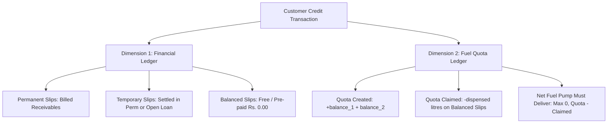

# Customer Credit & Fuel Ledger Report Module

The **Customer Credit & Fuel Ledger Report** (`reports/customer-report.php`) and its PDF companion (`reports/generate-pdf-customer-report.php`) provide comprehensive audit-grade tracking of customer credit slips, fuel quotas, loan chits, and financial receivables.

This module strictly implements the business logic defined in [`credit_sales.md`](credit_sales.md), ensuring an unambiguous separation between **Financial Receivables (Rupees)** and **Fuel Quota Obligations (Litres)** with 100% anti-double-counting guarantees.

---

## 1. Core Architecture & Two Ledger Dimensions

The report bifurcates every transaction into two independent but correlated dimensions:

### Dimension 1: Financial Ledger (Rupees)
- **Goal**: Answer *"How much money does this customer owe the petrol pump?"*
- Calculates the true billed receivable:
  $$\text{Total Invoiced Receivable} = \sum \text{Permanent Slip Charge Amounts}$$
- **Anti-Double-Counting Guarantee**:
  - When a Permanent Slip settles a Temporary Slip (Scenario 2), the loan petrol charge $(\text{wasoli} \times \text{temp\_rate})$ is billed directly on that Permanent Slip.
  - The settled Temporary Slip's own line item displays `Settled in Slip #<id>` with **Rs. 0.00** charge. The customer is never double-billed for the same petrol.
- **Balanced Slips** represent previously paid fuel claims and always carry **Rs. 0.00** charge.
- **Open Temporary Slips** represent physical loan petrol awaiting a permanent slip. They display **Rs. 0.00** in current billed receivables and are surfaced in an executive alert box as pending loan liabilities.

### Dimension 2: Fuel Quota Ledger (Litres)
- **Goal**: Answer *"How many litres of pre-billed petrol does the pump still owe the vehicle?"*
- When a customer purchases a voucher with remaining quota (e.g. 56 Ltr voucher with 30 Ltr pumped into tank and 26 Ltr stamped on the slip as balance):
  - **Quota Created**: $+(\text{balance\_1} + \text{balance\_2})\text{ Ltr}$ recorded on Permanent Slips.
  - **Quota Claimed**: $-(\text{quantity})\text{ Ltr}$ drawn against the quota on subsequent Balanced Slips.
  - **Net Fuel Pump Must Deliver**:
    $$\text{Remaining Balance} = \max(0, \sum \text{Quota Created} - \sum \text{Quota Claimed})$$
  - If the customer over-draws quota, an overdraw warning is displayed rather than allowing negative delivery liability.

---

## 2. Four Operational Scenarios in Action

The report handles all 4 transaction types identified in [`credit_sales.md`](credit_sales.md):

### Scenario 1: Standard Permanent Slip (Normal Credit Sale)
- **Description**: Customer arrives with a fresh voucher, fills fuel, and is invoiced.
- **Ledger Impact**:
  - **Issued (Ltr)**: Voucher capacity (or pumped volume if no split balance).
  - **Pumped (Ltr)**: Volume dispensed into tank (`quantity`).
  - **Balance Quota**: If voucher is not fully pumped, shows badge `+X.XX Ltr Quota`.
  - **Must Pay**: Full slip charge $\text{charge\_amount} = \text{issue\_quantity} \times \text{sale\_rate}$.

### Scenario 2: Permanent Slip Settling a Temporary Slip (Wasoli)
- **Description**: Customer arrives with a permanent slip that settles an earlier loan chit (e.g. wasoli of 10.53 Ltr from Slip #4010).
- **Ledger Impact**:
  - **Settling Permanent Slip**:
    - Displays green link badge: `🔗 Settles Temp #4010 (10.53 Ltr @ Rs. 285.00)`.
    - **Must Pay**: Includes the settled loan charge $(\text{wasoli} \times \text{temp\_rate})$ in its `charge_amount`.
  - **Settled Temporary Slip**:
    - Displays status badge: `✅ Settled in Slip #<id>`.
    - **Must Pay**: Shows `Rs. 0.00` with subtext `Billed on Slip #<id>` to prevent double charging.

### Scenario 3: Balanced Slip (Quota Claim)
- **Description**: Vehicle returns to collect fuel from a balance stamped on an earlier Permanent Slip.
- **Ledger Impact**:
  - **Slip Type Badge**: `Balanced Slip` (Info / Cyan badge).
  - **Pumped (Ltr)**: Volume pumped into the vehicle tank.
  - **Balance Quota**: Shows red reduction badge `-X.XX Ltr Claimed`.
  - **Must Pay**: **`Rs. 0.00`** with subtext `Pre-paid Quota Claim`.

### Scenario 4: Open Temporary Slip (Pending Loan Chit)
- **Description**: Driver took loan fuel on a temporary chit and the permanent voucher has not yet been processed.
- **Ledger Impact**:
  - **Slip Type Badge**: `Temporary Slip` (Warning badge).
  - **Temp. Receive Status**: `⏳ Open Loan Chit`.
  - **Must Pay**: **`Rs. 0.00`** in current ledger column with subtext `Pending Voucher`.
  - **Executive Alert Box**: Flashed at the top of the customer's ledger detailing the exact pending volume and estimated Rupees awaiting invoicing.

---

## 3. Ledger Table Columns Specification

The itemized report table renders 13 standardized columns:

| # | Column Name | Source Field / Formula | Description |
|---|---|---|---|
| 1 | `#` | Row counter | Sequential row index |
| 2 | `Slip Date` | `slip_date` | Date printed on the credit voucher |
| 3 | `Reading #` | `meter_reading_id` | Shift reading reference ID |
| 4 | `Slip No` | `slip_number` | Physical paper slip number |
| 5 | `Slip Type` | `slip_type` | `Permanent Slip`, `Balanced Slip`, or `Temporary Slip` with settlement tags |
| 6 | `Vehicle No` | `vehicle_number` | Registration plate (e.g. `LE-1234`, `LES-5678`) |
| 7 | `Nozzle / Fuel` | `fuel_name` & `nozzle_name` | Fuel grade (Super / Diesel) and physical nozzle |
| 8 | `Rate` | `sale_rate` | Historical unit price per litre |
| 9 | `Issued (Ltr)` | `issue_quantity` | Capacity printed on voucher |
| 10 | `Pumped (Ltr)` | `quantity` | Physical volume dispensed through nozzle |
| 11 | `Balance Quota` | `balance_1 + balance_2` or `-quantity` | Quota generated (`+`) or quota claimed (`-`) |
| 12 | `Temp. Receive` | `wasoli` & settlement status | Loan volume and whether settled or open |
| 13 | `Must Pay (Rs.)` | `charge_amount` | Invoiced receivable billed to customer |

---

## 4. Card 2: Two-Panel Reconciliation Summary

Directly beneath each customer's itemized slips table, **Card 2** displays two synchronized audit panels:

### Panel A: Financial Statement (Rupees)
Audits the exact billed receivables and collections:
- **Permanent Slips (Billed Invoices)**: Total billed charges across all permanent vouchers (including settled loans).
- **Balanced Slips (Claimed Fuel Quota)**: `Rs. 0.00 (Pre-paid)`.
- **Settled Temporary Slips**: `Rs. 0.00 (Billed in Permanent Slips)`.
- **Open Temporary Slips**: Flagged as pending (Estimated Rs.) if any exist.
- **👉 TOTAL INVOICED RECEIVABLE (MUST COLLECT)**:
  $$\mathbf{Rs.\; \text{Permanent Charges}}$$

### Panel B: Fuel Quota Reconciliation (Litres)
Reconciles physical fuel balance owed to the customer:
- **Total Quota Recorded**: Sum of `balance_1 + balance_2` from permanent vouchers.
- **Quota Claimed**: Sum of fuel dispensed on `Balanced Slips`.
- **⛽ NET PETROL VOLUME PUMP MUST DELIVER**:
  $$\mathbf{\max(0,\; \text{Quota Recorded} - \text{Quota Claimed})\text{ Ltr}}$$
- **Overdraw Detection**: If claimed litres exceed recorded quota, flags an explicit overdraw badge: `⚠️ Quota Overdrawn: X.XX Ltr`.

---

## 5. PDF Statement Generator Parity

The print-ready PDF generator (`reports/generate-pdf-customer-report.php`) shares 100% computational and stylistic parity with the web interface:
- **Strict Theme Adherence**: Deep navy primary headers (`#04204e`), clean borders, and monospace numeric alignments.
- **Signature Section**: Includes 3 formal sign-off boxes at the footer:
  1. *Prepared By (Pump Manager)*
  2. *Verified By (Accounts)*
  3. *Customer Signature*
- **Auto-Print Trigger**: Automatically invokes `window.print()` upon document load for one-click printing or PDF saving.

---

## 6. Verification and Integration Rules

1. **RBAC Protection**: Both `customer-report.php` and `generate-pdf-customer-report.php` enforce `check_access('reports', 'view')`.
2. **Auxiliary Column Auto-Migration**: If older database schemas lack `settled_in_slip_id` or `temp_rate`, the report auto-executes idempotent `ALTER TABLE` checks to prevent SQL failures.
3. **Multi-Vehicle Aggregation**: Customers with fleets (multiple vehicle numbers) are grouped by `customer_id`. Subtotals and ledgers reflect the customer's aggregate balance while identifying each vehicle per line.
