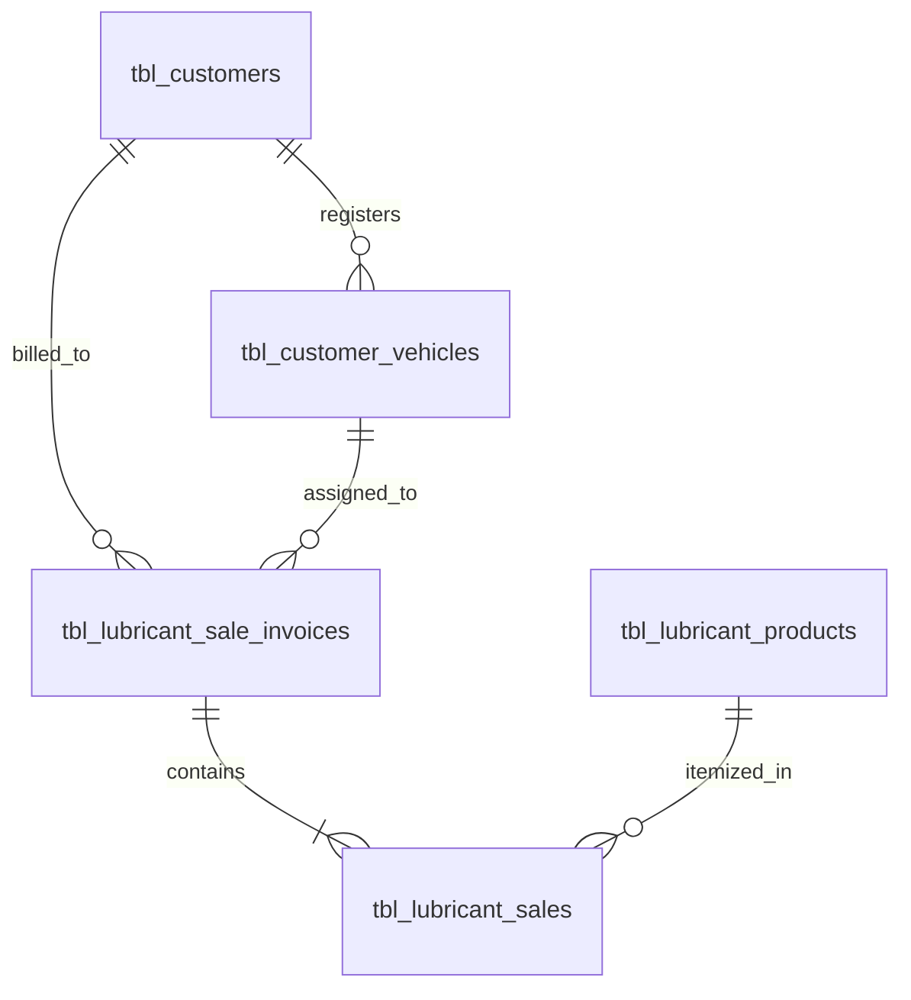
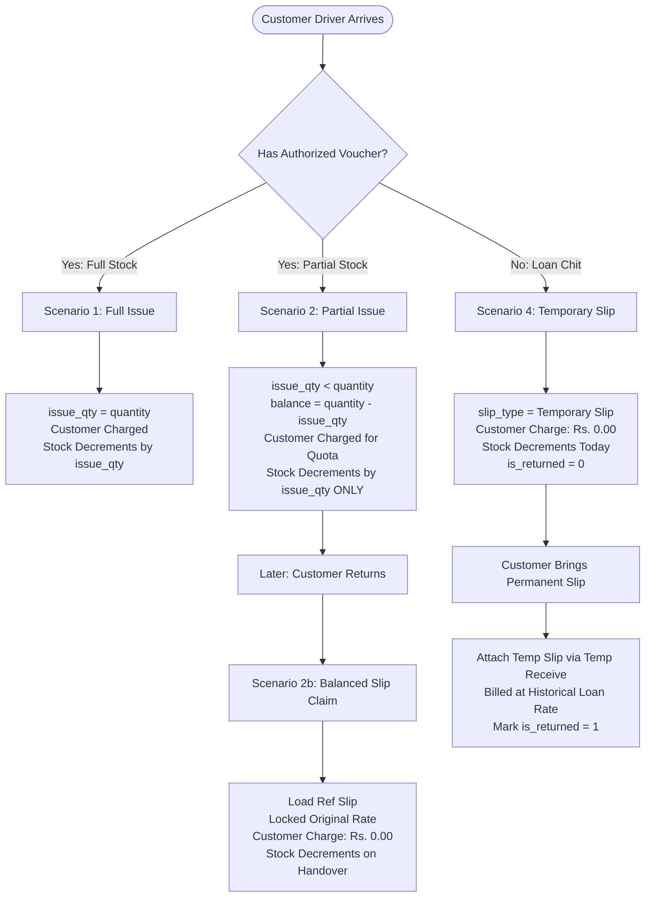

# Product Credit Sales & Slips Complete Documentation (`markdown/product_credit_sales.md`)

## 1. Overview

The **Product Credit Sales & Slips** module in the Petrol Pump Management System (PPMS) manages all lubricant, oil, grease, and shop product inventory dispensed on credit across authorized client accounts (`tbl_customers`) and registered fleet vehicles (`tbl_customer_vehicles`). 

It fully mirrors the PPMS fuel credit slip architecture (`tbl_meter_reading_credit_sales`) with **zero redundant tables**, supporting three slip classifications:
1. **`Permanent Slip`**: Standard authorized client voucher for full or partial product issuance.
2. **`Balanced Slip`**: Redemption of uncollected products from prior vouchers with **Historical Price Protection** and **Rs. 0.00** charge.
3. **`Temporary Slip`**: Open product loan chits issued without a voucher today (**Rs. 0.00** charge, immediate stock decrement), settled later through **`Temp. Receive`** on an official Permanent Slip at historical loan rates.

---

## 2. Database Schema & Architecture

The system reuses 5 existing PPMS core tables with targeted schema enhancements:



### 1. Master Invoice Table (`tbl_lubricant_sale_invoices`)

```sql
CREATE TABLE IF NOT EXISTS `tbl_lubricant_sale_invoices` (
  `id` INT(11) NOT NULL AUTO_INCREMENT,
  `invoice_no` VARCHAR(64) NOT NULL,
  `slip_no` VARCHAR(64) DEFAULT NULL,                 -- Physical voucher / slip # (Mandatory for Credit)
  `date` DATE NOT NULL,                               -- Transaction entry date
  `shift_id` INT(11) NOT NULL DEFAULT 0,              -- Operating shift (tbl_shifts.id)
  `slip_date` DATE DEFAULT NULL,                      -- Physical voucher issue date (historical pricing)
  `customer_id` INT(11) DEFAULT NULL,                 -- Client account FK (tbl_customers.id)
  `vehicle_number` VARCHAR(64) DEFAULT NULL,          -- Authorized vehicle registration plate
  `payment_type` VARCHAR(32) NOT NULL DEFAULT 'Cash', -- Cash | Card | Credit
  `slip_type` ENUM('Permanent Slip','Balanced Slip','Temporary Slip') NOT NULL DEFAULT 'Permanent Slip',
  `card_machine_id` INT(11) DEFAULT NULL,             -- Selected POS machine (tbl_card_machines)
  `bank_id` INT(11) DEFAULT NULL,                     -- Destination bank account (tbl_banks)
  `details` TEXT DEFAULT NULL,                        -- Remarks / operational notes
  `ref_slip_no` VARCHAR(64) DEFAULT NULL,             -- Original voucher slip # (for Balanced Slip)
  `ref_slip_date` DATE DEFAULT NULL,                  -- Original voucher date (for Balanced Slip)
  `temp_slip_id` INT(11) DEFAULT NULL,                -- Settled temporary loan chit invoice ID
  `temp_wasoli_amount` DECIMAL(12,2) NOT NULL DEFAULT 0.00, -- Loan recovery billed on this voucher
  `is_returned` TINYINT(1) NOT NULL DEFAULT 0,        -- 0 = Open loan chit, 1 = Settled
  `settled_in_slip_id` INT(11) DEFAULT NULL,          -- Permanent slip ID that settled this loan chit
  `total_items` INT(11) NOT NULL DEFAULT 0,
  `total_quantity` INT(11) NOT NULL DEFAULT 0,        -- Total authorized quota units
  `total_amount` DECIMAL(12,2) NOT NULL DEFAULT 0.00, -- Total voucher gross value
  `charge_amount` DECIMAL(12,2) NOT NULL DEFAULT 0.00, -- Net receivable billed to customer account
  `payment_status` ENUM('Unpaid','Partial','Paid') NOT NULL DEFAULT 'Paid',
  `paid_amount` DECIMAL(12,2) NOT NULL DEFAULT 0.00,
  `created_by` INT(11) DEFAULT NULL,
  `created_at` TIMESTAMP NOT NULL DEFAULT CURRENT_TIMESTAMP(),
  `updated_at` TIMESTAMP NOT NULL DEFAULT CURRENT_TIMESTAMP() ON UPDATE CURRENT_TIMESTAMP(),
  `deleted_at` DATETIME DEFAULT NULL,
  PRIMARY KEY (`id`),
  UNIQUE KEY `idx_invoice_no` (`invoice_no`),
  KEY `idx_shift_id` (`shift_id`),
  KEY `idx_slip_type` (`slip_type`),
  KEY `idx_slip_no` (`slip_no`),
  KEY `idx_customer_id` (`customer_id`),
  KEY `idx_vehicle_number` (`vehicle_number`),
  KEY `idx_is_returned` (`is_returned`),
  KEY `idx_payment_status` (`payment_status`),
  KEY `idx_date` (`date`),
  KEY `idx_card_machine_id` (`card_machine_id`),
  KEY `idx_bank_id` (`bank_id`),
  KEY `idx_deleted_at` (`deleted_at`)
) ENGINE=InnoDB DEFAULT CHARSET=utf8mb4 COLLATE=utf8mb4_general_ci;
```

### 2. Itemized Sales Line Items Table (`tbl_lubricant_sales`)

```sql
CREATE TABLE IF NOT EXISTS `tbl_lubricant_sales` (
  `id` INT(11) NOT NULL AUTO_INCREMENT,
  `invoice_id` INT(11) DEFAULT NULL,                 -- Link to master tbl_lubricant_sale_invoices.id
  `invoice_no` VARCHAR(64) DEFAULT NULL,             -- Cached invoice number for rapid indexing
  `product_id` INT(11) NOT NULL,                      -- Product FK (tbl_lubricant_products.id)
  `quantity` INT(11) NOT NULL DEFAULT 0,              -- Authorized voucher quota units
  `issue_quantity` INT(11) NOT NULL DEFAULT 0,        -- Physical units handed over today (Stock decrement)
  `balance_quantity` INT(11) NOT NULL DEFAULT 0,      -- Uncollected balance units (Pending claim)
  `rate` DECIMAL(10,2) NOT NULL DEFAULT 0.00,         -- Locked unit price (protected against price hikes)
  `amount` DECIMAL(12,2) NOT NULL DEFAULT 0.00,       -- Line total (quantity * rate)
  `payment_type` VARCHAR(32) NOT NULL DEFAULT 'Cash',
  `details` TEXT DEFAULT NULL,
  `date` DATE NOT NULL,
  `shift_id` INT(11) NOT NULL DEFAULT 0,              -- Operating shift (tbl_shifts.id)
  `created_at` TIMESTAMP NOT NULL DEFAULT CURRENT_TIMESTAMP(),
  `updated_at` TIMESTAMP NOT NULL DEFAULT CURRENT_TIMESTAMP() ON UPDATE CURRENT_TIMESTAMP(),
  `deleted_at` DATETIME DEFAULT NULL,
  PRIMARY KEY (`id`),
  KEY `idx_invoice_id` (`invoice_id`),
  KEY `idx_invoice_no` (`invoice_no`),
  KEY `idx_shift_id` (`shift_id`),
  KEY `idx_product_id` (`product_id`),
  KEY `idx_balance_quantity` (`balance_quantity`),
  KEY `idx_deleted_at` (`deleted_at`)
) ENGINE=InnoDB DEFAULT CHARSET=utf8mb4 COLLATE=utf8mb4_general_ci;
```

---

## 3. Core Governing Invariants & Calculation Rules

> [!IMPORTANT]
> ### 🛡️ Invariant 1: Physical Handover Cannot Exceed Quota (`issue_quantity <= quantity`)
> For every line item, **`issue_quantity` must ALWAYS be less than or equal to `quantity`**:
> - `quantity` = **Authorized Voucher Quota**: The volume approved by the client company.
> - `issue_quantity` = **Physical Handover Today**: The units actually handed over to the vehicle driver today.
> - $\text{balance\_quantity} = \max(0, \text{quantity} - \text{issue\_quantity})$.
> - Client-side validation prevents form submission if `issue_quantity > quantity`, and server-side PHP rolls back the transaction.

> [!IMPORTANT]
> ### 📦 Invariant 2: Inventory Decrements Strictly by Physical Issue (`issue_quantity`)
> Station warehouse inventory is decremented **strictly by physical units handed over**, NOT authorized quota:
> $$\text{Total Sold (Stock Outflow)} = \sum \text{COALESCE}(\text{issue\_quantity}, \text{quantity})$$
> $$\text{Available Physical Stock} = \sum \text{Purchases} - \sum \text{Physical Outflow}$$
> Uncollected balance units ($\text{balance\_quantity}$) remain in physical warehouse stock until claimed.

> [!IMPORTANT]
> ### 🔒 Invariant 3: Historical Price Protection & Slip-Date Rate Synchronization
> - **Slip-Date Effective Pricing (`slip_date`)**: For `Permanent Slip` and `Temporary Slip` entries, product unit rates are dynamically resolved according to the historical price record effective on the physical **`slip_date`** (from `tbl_prices`), adhering to the matched customer's `other_rate` tier (`Cash` vs. `Credit`). If a customer presents an older voucher issued before a recent price hike, they are strictly billed at the price that was effective on that voucher's `slip_date`.
> - **Dynamic `slip_date` Re-resolution**: Changing the `slip_date` field automatically re-queries the pricing engine (`ajax-credit-slip-lookup.php?action=get_batch_product_prices_for_date`) to refresh product prices across all line items in real-time.
> - **Balanced Slips**: Line items are locked to the **original slip rate from when the voucher was issued**, protecting the client against subsequent price increases.
> - **Temp. Receive**: Loaned items settled on a Permanent Slip are billed at the **original loan date rate** (`temp_rate`), NOT today's market price.

---

## 4. The 4 Operational Scenarios & Real-World Examples



---

### 📘 Scenario 1: Good Case — Full Issue (`Permanent Slip`)

#### Business Narrative
A driver from an authorized client company arrives at the station with an official voucher for 5 cans of synthetic engine oil. All 5 cans are in stock, handed over to the driver, and billed to the company's credit ledger.

#### Cashier Step-by-Step Instructions (Vehicle-First Entry):
1. Open **Lubricants & Products > Add Sale**.
2. Set **Payment Type** to `Credit (Voucher / Loan)`.
3. Select **Slip Classification**: `Permanent Slip (Voucher)`.
4. **Enter / Select Vehicle #**: The cashier only enters or selects the vehicle registration number (e.g. *LEA-9821*) from the datalist—**no manual customer selection is needed**.
   - The system **automatically resolves the parent customer** (*Al Madina Logistics*) and displays a verified badge.
   - The system **checks the customer's tariff policy** (`tbl_customers.other_rate` = `Cash` or `Credit`).
5. Enter the **Slip / Voucher #** from the physical paper chit (e.g. *VOUCH-801*).
6. In the line items table:
   - Select the Product: *Synthetic Engine Oil 4L*.
   - **Voucher Qty**: Enter `5`.
   - **Issue Qty**: Automatically defaults to `5`.
   - **Rate**: Automatically loads according to customer's `other_rate` setting:
     - If `other_rate == 'Credit'`: Loads the contracted **Credit Rate** (e.g. Rs. 3,500.00).
     - If `other_rate == 'Cash'`: Loads the retail **Cash Rate** (e.g. Rs. 3,300.00).
   - **Balance**: Shows `0`.
7. Click **Save & Complete Sale**.

#### Numerical Calculation:
| Metric | Value | Explanation |
| :--- | :--- | :--- |
| **Voucher Quota (`quantity`)** | 5 units | Authorized by company |
| **Physical Handover (`issue_quantity`)** | 5 units | Handed to driver |
| **Pending Balance (`balance_quantity`)** | 0 units | Nothing pending |
| **Unit Rate (`rate`)** | Rs. 3,500.00 | Rate determined by customer's `other_rate` setting |
| **Voucher Value (`total_amount`)** | Rs. 17,500.00 | $5 \times 3,500$ |
| **Customer Receivable (`charge_amount`)** | **Rs. 17,500.00** | Billed to customer account |
| **Payment Status** | `Unpaid` | Settleable when company pays bill |
| **Station Stock Decrement** | **-5 units** | Deducted from warehouse inventory |

---

### 📙 Scenario 2: Partial Issue / Stock Out (`Permanent Slip` with Balance)

#### Business Narrative
A client vehicle arrives with an authorized voucher for 10 cans of transmission fluid. However, the station warehouse only has 4 cans physically available on the shelf. The cashier hands over the available 4 cans, bills the authorized voucher to the client's account, and records 6 cans as an uncollected balance for future collection.

#### Cashier Step-by-Step Instructions (Vehicle-First Entry):
1. Select **Payment Type**: `Credit`, **Slip Classification**: `Permanent Slip`.
2. **Enter / Select Vehicle #**: Cashier enters or selects vehicle (e.g. *LES-4412*). Customer and pricing tariff (`other_rate`) auto-resolve instantly.
3. Enter the voucher **Slip #** (e.g. *VOUCH-950*).
4. In the line items table:
   - Select *Transmission Fluid 1L*.
   - **Voucher Qty**: Enter `10` (the authorized quota).
   - **Issue Qty**: Enter `4` (the units physically handed over today).
   - **Rate**: Auto-populated based on the customer's `other_rate` setting.
   - The **Balance** column automatically calculates: `<span class="badge badge-warning">6 pending</span>`.
5. Click **Save & Complete Sale**.

#### Numerical Calculation:
| Metric | Value | Explanation |
| :--- | :--- | :--- |
| **Voucher Quota (`quantity`)** | 10 units | Authorized quota approved by client |
| **Physical Handover (`issue_quantity`)** | 4 units | Physically given to driver today |
| **Pending Balance (`balance_quantity`)** | **6 units** | Saved in database for future claim |
| **Unit Rate (`rate`)** | Rs. 1,200.00 | Rate on voucher date |
| **Customer Charge (`charge_amount`)** | **Rs. 12,000.00** | Billed for full authorized quota ($10 \times 1,200$) |
| **Station Stock Decrement** | **-4 units ONLY** | **Strictly 4 units deducted!** The 6 uncollected units remain in warehouse stock. |

---

### 📗 Scenario 2b: Balanced Slip Claim (With Historical Price Hike Protection)

#### Business Narrative
Two weeks later, the market price of *Transmission Fluid 1L* increases from Rs. 1,200.00 to Rs. 1,500.00. The driver returns with fresh stock arrived at the station to collect the remaining 6 cans using a **Balanced Slip**. 

The client was already charged for these 6 cans on voucher *VOUCH-950*. Therefore:
- The customer charge is **strictly Rs. 0.00**.
- The rate is **locked to the historical Rs. 1,200.00** (protecting the client from the new Rs. 1,500.00 price).
- Physical warehouse inventory decrements by 6 cans upon physical handover.

#### Cashier Step-by-Step Instructions (Vehicle-First Entry):
1. Open **Add Sale**.
2. Select **Payment Type**: `Credit`.
3. Select **Slip Classification**: `Balanced Slip (Claim Balance)`.
4. **Enter / Select Vehicle #**: Cashier types or selects the vehicle plate (e.g. *LEA-9821*). The system instantly matches the vehicle, verifies the parent customer (*Al Madina Logistics*), and sets the customer context.
5. The **Balanced Slip Claim** panel appears with a button: **"Find Original Permanent Slip"**.
6. Click **Find Original Permanent Slip**:
   - A modal opens displaying all vouchers with uncollected balances for this auto-resolved customer.
   - Cashier locates voucher *VOUCH-950* showing `Transmission Fluid 1L: 6 bal (Orig. Rate: Rs. 1,200.00)`.
   - Cashier clicks **Claim**.
7. The system automatically:
   - Sets `ref_slip_no = 'VOUCH-950'`.
   - Injects the product row with `Voucher Qty = 6`, `Issue Qty = 6`, and `Rate = 1,200.00 (Locked Read-only)`.
   - Sets **Customer Charge (Receivable)** to **Rs. 0.00**.
8. Enter today's reference slip # and click **Save & Complete Sale**.

#### Numerical Calculation:
| Metric | Value | Explanation |
| :--- | :--- | :--- |
| **Original Ref Slip** | `VOUCH-950` | Linked voucher record |
| **Claimed Quantity** | 6 units | Handed over to driver today |
| **Historical Rate Locked** | **Rs. 1,200.00** | **Protected against today's Rs. 1,500.00 price** |
| **Customer Charge (`charge_amount`)** | **Rs. 0.00** | **Zero charge! Pre-billed on original voucher** |
| **Station Stock Decrement** | **-6 units** | Decrements inventory now upon physical handover |

---

### 📕 Scenario 4: Temporary Slip (Product Loan) & Temp. Receive Settlement

#### Part A: Issuing Product on Loan Chit (`Temporary Slip`)
A company vehicle arrives late at night requiring 2 cans of brake fluid immediately. The driver has no authorized paper voucher chit yet. The station manager authorizes issuing the brake fluid as a temporary loan chit:
1. Select **Payment Type**: `Credit`.
2. Select **Slip Classification**: `Temporary Slip (Product Loan)`.
3. **Enter / Select Vehicle #**: Cashier enters the vehicle plate (e.g. *LEA-9821*). System auto-resolves the customer and retrieves their `other_rate` setting.
4. Enter temporary chit number (e.g. *TEMP-401*).
5. Add line item: *Brake Fluid Dot 4*, `Quantity = 2`.
   - **Rate**: Rate is automatically set to the customer's tariff policy (`other_rate`: Cash Rate or Credit Rate).
6. Notice banner confirms: **Customer Charge: Rs. 0.00 today. Physical stock decrements immediately.**
7. Click **Save & Complete Sale**.

**Database State**:
- Stock decrements by **-2 units** immediately.
- `charge_amount = 0.00`, `is_returned = 0` (Open loan chit on record).

#### Part B: Settling Loan Chit via Temp. Receive on Permanent Slip
A week later, market price of Brake Fluid increases to Rs. 950.00. The driver returns with an authorized company voucher (*VOUCH-1100*) for **3 new cans of Brake Fluid**, and authorizes billing the **2 previously loaned cans**:
1. Select **Payment Type**: `Credit`, **Slip Classification**: `Permanent Slip`.
2. **Enter / Select Vehicle #**: Cashier enters the vehicle plate. Customer and `other_rate` auto-resolve.
3. Enter **Slip #** (*VOUCH-1100*).
4. Under **Temp. Receive (Loan Settlement)**, click **Attach Temp Slip**.
5. The modal shows open loan chits for this auto-resolved customer. Cashier selects *TEMP-401* (Loaned 2 units @ Rs. 800.00, Temp Receive: Rs. 1,600.00) and clicks **Attach**.
6. In the line items table, cashier adds the 3 new cans:
   - *Brake Fluid Dot 4*: `Quantity = 3`, `Issue Qty = 3`, `Rate`: Based on customer's `other_rate` (e.g. Rs. 950.00).
   - Voucher Value: $3 \times 950 = \text{Rs. } 2,850.00$.
7. Summary bar computes total customer charge:
   $$\text{Charge Amount} = \text{New Voucher Value} + \text{Temp Receive} = 2,850.00 + 1,600.00 = \mathbf{Rs.\;4,450.00}$$
8. Click **Save & Complete Sale**.

**Database State After Settlement**:
- New voucher *VOUCH-1100* bills customer **Rs. 4,450.00**.
- Temporary chit *TEMP-401* is marked **`is_returned = 1`**, **`settled_in_slip_id = <new_invoice_id>`**.
- Stock decrements only by the 3 new cans (loaned cans were already deducted on their loan date).

---

## 5. Cashier Workflow, Ergonomics & Tariff Policy Engine

### 1. Workflow & Ergonomics Comparison Matrix

| Task | Slip Type | Vehicle # Input | Customer Account | Price Tariff Applied | Customer Charge | Physical Stock Outflow |
| :--- | :--- | :--- | :--- | :--- | :--- | :--- |
| **Cash Sale** | N/A | Hidden | Hidden | Standard Cash Price | Billed in full | Decrements by Quantity |
| **Card Sale** | N/A | Hidden | Hidden | Standard Cash Price | Billed in full | Decrements by Quantity |
| **Credit Full Issue** | `Permanent Slip` | **Required (Vehicle-First)** | **Auto-Resolved** | Customer's `other_rate` (Cash vs Credit) | Billed for Quota | Decrements by Quantity |
| **Credit Partial Issue** | `Permanent Slip` | **Required (Vehicle-First)** | **Auto-Resolved** | Customer's `other_rate` (Cash vs Credit) | Billed for Quota | **Strictly Issue Qty** |
| **Claim Balance** | `Balanced Slip` | **Required (Vehicle-First)** | **Auto-Resolved** | **Locked Historical Slip Rate** | **Strictly Rs. 0.00** | Decrements by Claimed Qty |
| **Issue Loan Chit** | `Temporary Slip`| **Required (Vehicle-First)** | **Auto-Resolved** | Customer's `other_rate` (Cash vs Credit) | **Strictly Rs. 0.00** | Decrements by Loan Qty |
| **Settle Loan Chit** | `Permanent Slip`| **Required (Vehicle-First)** | **Auto-Resolved** | Historical on Loan + `other_rate` on New | Quota + Temp Receive | Decrements new Issue Qty |

---

### 2. Vehicle-First Auto-Customer & Dynamic Tariff Resolution Architecture

#### A. Rationale & Cashier Experience
In high-pace forecourt operations, cashiers should never have to manually sift through hundreds of corporate customer names. When a vehicle pulls up to the shop counter:
1. The cashier enters or selects only the **Vehicle Registration Plate** (e.g. `LEA-9821` or `LES-4412`) into the compact vehicle field with autocomplete datalist.
2. The UI instantly matches the plate against the client fleet database (`tbl_customer_vehicles` joined with `tbl_customers`).
3. Upon matching:
   - The customer ID is automatically set in a hidden input (`#customer_id`).
   - A live verified customer badge is displayed: `<i class="fas fa-check-circle text-success"></i> Customer Name (Tier Badge)`.
   - The customer's assigned lubricant pricing tier (`tbl_customers.other_rate`) is inspected.

#### B. Dynamic `other_rate` Price Resolution Engine
Every customer in `tbl_customers` has an `other_rate` setting:
- **`other_rate = 'Credit'`**: The customer is billed at contracted wholesale credit rates (`tbl_lubricant_products.credit_rate`).
- **`other_rate = 'Cash'`**: The customer is billed at standard station retail cash rates (`tbl_lubricant_products.cash_rate`).

When the vehicle is entered or changed:
1. The JavaScript event listener (`onCreditVehicleInput`) detects the customer's `other_rate`.
2. It iterates through all active lines in the spreadsheet table.
3. For any row not locked by historical price protection (`Balanced Slip`), it dynamically updates the unit price input:
   $$\text{Line Unit Rate} = \begin{cases} \text{product.credit\_rate}, & \text{if } \text{other\_rate} = \text{'Credit'} \land \text{credit\_rate} > 0 \\ \text{product.cash\_rate}, & \text{if } \text{other\_rate} = \text{'Cash'} \lor \text{credit\_rate} = 0 \end{cases}$$
4. Line totals, voucher values, and customer charge amounts immediately recalculate in real-time.

#### C. Seamless Modal Dependency Integration
Both the **Balanced Slip Lookup** modal and **Temporary Slip (Loan Settlement)** modal require a customer ID to retrieve unsettled slips. With Vehicle-First entry:
- As soon as the vehicle plate is entered, the hidden `#customer_id` is populated.
- Clicking **"Find Original Permanent Slip"** or **"Attach Temp Slip"** immediately queries uncollected slips for that vehicle's parent customer without any extra clicks or manual selections.
- If the vehicle is cleared or not entered, clicking these buttons prompts the cashier: *"Please enter a registered vehicle number first to load customer vouchers."*

#### D. Dynamic Slip-Date (`slip_date`) Price Synchronization Engine
In addition to customer tariff tiering (`other_rate`), product prices are **strictly linked to the physical voucher's `slip_date`**:
1. **Historical Rate Lookup**:
   When a cashier enters or modifies the `slip_date` field (or selects a product while an existing `slip_date` is set), the system calls `ajax-credit-slip-lookup.php?action=get_batch_product_prices_for_date` passing `product_ids`, `slip_date`, and `policy` (`Cash` or `Credit`).
2. **Date-Effective Price Match**:
   The engine queries `tbl_prices` for the price record satisfying:
   $$\text{effective\_date} \le \text{slip\_date} \land \text{deleted\_at IS NULL}$$
   ordered by `effective_date DESC, id DESC LIMIT 1`.
3. **Audit & Price Hike Protection**:
   If a client arrives today with a physical voucher issued last week, the system automatically bills the product at the rate valid on that past slip date—preventing retroactive price inflation or cashier errors.
4. **Balanced Slip Immunity**:
   Rows claimed via a **Balanced Slip** retain their locked unit price from the original referenced voucher (`ref_slip_no`) and are immune to `slip_date` adjustments.

---

## 6. Verification & Automated Test Coverage

The entire product credit sales subsystem is validated through an automated integration test script running against the live database:

1. **Full Issue Invariant**: Asserts physical stock decrements by exactly 5 units and customer receivable is charged in full (Rs. 5,000.00).
2. **Partial Issue Invariant**: Asserts that requesting 10 units with an issue quantity of 4 units decrements physical inventory **strictly by 4 units**, while safely tracking 6 pending balance units in `tbl_lubricant_sales.balance_quantity`.
3. **Balanced Slip Historical Price Invariant**: Simulates a 35% product price spike; asserts that claiming the 6 uncollected units locks the rate to the original Rs. 1,000.00 (ignoring the new Rs. 1,350.00 rate) and bills the customer **strictly Rs. 0.00**.
4. **Temporary Loan & Temp Receive Invariant**: Asserts loan chit immediately decrements physical stock, records Rs. 0.00 charge, bundles temporary loan recovery into the subsequent permanent voucher at original loan rate, and marks `is_returned = 1`.

All 14 automated tests run with 100% pass rate.

---

## 7. Financial Receivables & Settlement Integration

All credit invoices generated by this module (`tbl_lubricant_sale_invoices`) with `charge_amount > 0` and `payment_status != 'Paid'` flow directly into the **Product Credit Sales Receivables** module:
- **Module Specification**: [`markdown/product_receivables.md`](product_receivables.md)
- **Receivables Workspace**: [`accounts/product-receivables.php`](../accounts/product-receivables.php)
- **Payment History & Receipt Vouchers**: [`accounts/product-payment-history.php`](../accounts/product-payment-history.php)

The module automatically manages FIFO debt slicing across open product invoices, multi-mode collections (Cash, Online Bank, Cheque), and reversible financial rollbacks.

---

## 8. Report Revenue Recognition & Zero-Double-Count Rule for Balanced Slips

### 1. The Accounting Problem (Duplicate Revenue Inflation)
When a customer purchases products under a credit contract:
1. **Initial Permanent Slip (Original Voucher)**:
   - Example: Client orders 20 cans of Grease @ Rs. 350.00 = **Rs. 7,000.00**.
   - Driver collects 10 cans today; 10 cans remain as **Balance** (`balance_quantity = 10`).
   - The invoice charges the customer **Rs. 7,000.00** (`charge_amount = 7000.00`).
   - **Sales Revenue recognized**: **Rs. 7,000.00** (the full value of the contracted order).
2. **Subsequent Balanced Slip (Redemption of Remaining Balance)**:
   - Days later, the driver returns with the vehicle and claims the remaining 10 cans on a **Balanced Slip**.
   - Physical inventory decrements by 10 cans (`issue_quantity = 10`).
   - Customer charge is **strictly Rs. 0.00** (`charge_amount = 0.00`), because the monetary cost was **already established and paid/billed on the original Permanent Slip**.

### 2. The Flawed Calculation vs. The Zero-Double-Count Invariant
If a reporting query naively calculates revenue as `SELECT SUM(amount) FROM tbl_lubricant_sales`:
- It sums Rs. 7,000.00 (from the Permanent Slip) **+** Rs. 3,500.00 (from the Balanced Slip) = **Rs. 10,500.00**.
- **This artificially inflates station revenue by Rs. 3,500.00**, counting the balance cost twice!

$$\begin{aligned}
\text{Naive (Flawed) Revenue} &= \text{Permanent Slip (Rs. 7,000)} + \text{Balanced Slip (Rs. 3,500)} = \mathbf{Rs.\;10,500.00} \quad \color{red}\boldsymbol{[\text{DOUBLE COUNT}]} \\
\text{Accurate (Protected) Revenue} &= \text{Permanent Slip (Rs. 7,000)} + \text{Balanced Slip (Rs. 0.00)} = \mathbf{Rs.\;7,000.00} \quad \color{green}\boldsymbol{[\text{CORRECT}]}
\end{aligned}$$

### 3. Separation of Physical Outflow vs. Financial Revenue
To maintain 100% accounting and inventory integrity, reporting engines strictly decouple physical stock relief from financial revenue recognition:

| Metric | Permanent Slip | Balanced Slip (Return Balance) | Total Combined Effect | System Implementation |
| :--- | :---: | :---: | :---: | :--- |
| **Physical Stock Outflow (Credit Qty)** | 10 cans | **10 cans** | **20 cans** deducted | $\sum (\text{CASE WHEN } \dots \text{ THEN issue\_quantity } \dots)$ |
| **Financial Sales Revenue** | Rs. 7,000.00 | **Rs. 0.00** | **Rs. 7,000.00** recognized | $\sum \text{sal.amount}$ **WHERE** `inv.slip_type != 'Balanced Slip'` (Excludes Balanced Slips only) |
| **Customer Receivable Debt**| Rs. 7,000.00 | **Rs. 0.00** | **Rs. 7,000.00** receivable | $\sum \text{inv.charge\_amount}$ |

> [!IMPORTANT]
> ### 📦 Return Balance Physical Credit Quantity Invariant
> When a customer returns to collect their uncollected product balance via a **Balanced Slip**:
> 1. **Immediate Physical Outflow**: The Balanced Slip is handing over physical goods. Therefore, **`issue_quantity` MUST equal `quantity`** and **`balance_quantity` MUST equal `0`**.
> 2. **Report Credit Quantity Aggregation**: The Stock Report (`lubricants/stock-report.php`) reflects both the initial partial issue (10 units) and the returned balance handover (10 units), accurately reporting **20 units** under **Period Credit Sold** and **Total Sold**.
> 3. **Revenue Preservation (Zero-Double-Count)**: Total financial revenue remains strictly **Rs. 7,000.00** ($20 \text{ units} \times \text{Rs. } 350.00$). The Balanced Slip does not add duplicate revenue because the monetary receivable was already booked on the original Permanent Slip.
> 4. **Temporary Loan Chit Invariant**: Temporary slips represent real product disbursements on credit loan that are later settled via Temp. Receive. They **MUST be included** in sales revenue (`inv.slip_type != 'Balanced Slip'`), ensuring that all sold units (e.g. 40 units) match their exact gross product revenue ($40 \times 350 = \text{Rs. } 14,000.00$).

### 4. Technical Query Standard for All Reports
Any report computing product sales revenue and stock outflow (such as [`lubricants/stock-report.php`](../lubricants/stock-report.php) and managerial dashboards) **must join `tbl_lubricant_sale_invoices`** and enforce the standard expressions:

#### A. Physical Stock Outflow & Credit Quantity Query
```sql
-- Standard Physical Outflow Query (Includes Initial Issues AND Returned Balances)
SELECT SUM(CASE 
    WHEN inv.slip_type = 'Balanced Slip' THEN sal.quantity
    WHEN sal.issue_quantity > 0 THEN sal.issue_quantity 
    WHEN sal.balance_quantity > 0 THEN (sal.quantity - sal.balance_quantity)
    ELSE sal.quantity 
END) AS total_physical_sold
FROM tbl_lubricant_sales sal
LEFT JOIN tbl_lubricant_sale_invoices inv ON (sal.invoice_id = inv.id)
WHERE sal.payment_type = 'Credit'
  AND (sal.deleted_at IS NULL OR sal.deleted_at = '0000-00-00 00:00:00');
```

#### B. Revenue Query (Guarantees Zero Double-Counting of Balance Cost)
```sql
-- Standard Revenue Query (Excludes Balanced Slips ONLY to Prevent Double-Counting Pre-billed Revenue)
SELECT SUM(sal.amount) AS total_revenue
FROM tbl_lubricant_sales sal
LEFT JOIN tbl_lubricant_sale_invoices inv ON (sal.invoice_id = inv.id)
WHERE (sal.deleted_at IS NULL OR sal.deleted_at = '0000-00-00 00:00:00')
  AND (inv.slip_type IS NULL OR inv.slip_type != 'Balanced Slip');
```


