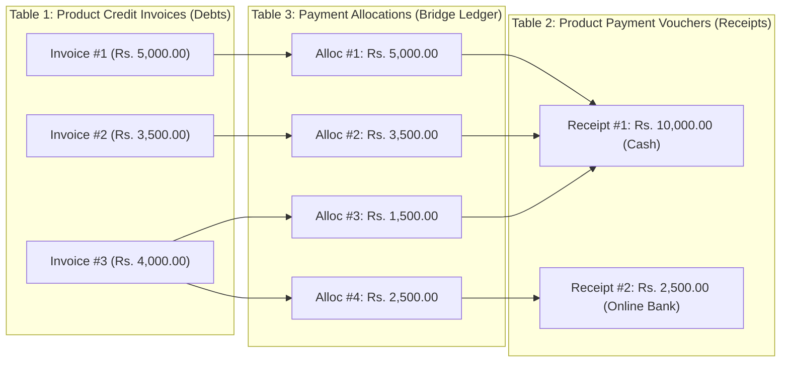

# Product Credit Sales Receivables & Customer Payments Module (`markdown/product_receivables.md`)

The **Product Credit Sales Receivables** module (`accounts/product-receivables.php`, `accounts/product-payment-history.php`) provides full credit sales billing, customer payment collection, and multi-mode financial reconciliation for lubricant and packaged inventory items (`tbl_lubricant_sale_invoices`).

It guarantees strict audit integrity, partial slip debt cutting via FIFO, multi-mode collections (Cash, Online Bank Deposit, Cheque), and 100% soft-delete reversibility with zero risk of regression to fuel credit sales.

---

## 1. Relational Architecture ($M:N$ Relationship)

In commercial petrol pump accounting, customer payments and product credit sales slips form a **Many-to-Many ($M:N$)** relationship across three dedicated tables:



### Why a Single `payment_id` on the Sales Invoices Table Fails:
1. **One payment settles multiple product invoices**:
   - Customer pays **Rs. 10,000** in cash.
   - This single payment settles Invoice #1 (Rs. 5,000), Invoice #2 (Rs. 3,500), and partial Invoice #3 (Rs. 1,500).
   - A single table cannot store 1 payment receipt across 3 separate invoices without data duplication.
2. **One invoice is settled across multiple installments**:
   - **Invoice #3** (Total: Rs. 4,000):
     - **Installment 1**: Customer pays **Rs. 1,500** in cash (Receipt #1).
     - **Installment 2**: Customer pays remaining **Rs. 2,500** via Online Bank transfer (Receipt #2).
   - With the 3-table structure, every transaction preserves an immutable audit trail without overwriting foreign keys.
3. **The 3-Table Relational Model**:
   - **`tbl_lubricant_sale_invoices`**: Records **what was purchased and charged**.
   - **`tbl_product_payments`**: Records **the master payment received** (Receipt #, Customer, Date, Total Amount, Mode, Bank/Cheque, Filter Context).
   - **`tbl_product_payment_allocations`**: The silent ledger bridge recording **how much money from Receipt X settled Invoice Y**.

---

## 2. The 10 Edge Cases & System Solutions

| # | Edge Case | Business Challenge | System Solution & Protection |
|:---:|:---|:---|:---|
| **1** | **Partial Slip Cutting** | Payment does not fully cover the oldest open invoice (e.g. Invoice owes Rs. 4,000, only Rs. 1,500 remaining). | Allocation table records exactly **Rs. 1,500.00**. Invoice updates to `paid_amount = 1500.00`, `payment_status = 'Partial'`, leaving **Rs. 2,500.00** remaining due. |
| **2** | **Finishing an Already-Partial Slip** | Customer previously paid Rs. 1,500 on an invoice. Next week, pays Rs. 2,500. | FIFO engine evaluates `(charge_amount - paid_amount)` = $4,000 - 1,500 = \mathbf{Rs.\ 2,500.00}$. It allocates Rs. 2,500, sets `paid_amount = 4000.00`, and transitions status to **`Paid`**. |
| **3** | **Overpayment Prevention (No Extra Pay)** | Cashier enters Rs. 15,000 when customer only owes Rs. 12,500. | Strict UI & server validation: Maximum payment is capped at `total_due`. Overpayment is rejected with error: *"Payment amount cannot exceed total outstanding balance of Rs. 12,500.00"*. |
| **4** | **Zero or Negative Amounts** | Accidental entry of 0 or negative values. | Constrained to `min="0.01"` and server-side guard `floatval($amount) <= 0` immediately halts execution. |
| **5** | **Strict Soft Delete & Rollback** | Payment entered by mistake needs removal without corrupting accounts. | Dedicated rollback endpoint `include/delete_product_payment.php`: Soft-deletes payment and allocations (`deleted_at = NOW()`), subtracts allocated amounts from each invoice's `paid_amount`, and reverts status back to `Unpaid` or `Partial`. |
| **6** | **Concurrent / Race Condition** | Two cashiers record payment for the same customer simultaneously. | Atomic database transaction (`mysqli_begin_transaction`) with `FOR UPDATE` row-level locks on open `tbl_lubricant_sale_invoices`. |
| **7** | **Zero-Charge / Balanced Slips Exclusion** | Invoices claimed on `Balanced Slip` have `charge_amount = 0.00`. | Receivables query strictly filters `WHERE payment_type = 'Credit' AND slip_type = 'Permanent Slip' AND charge_amount > 0`. Zero-charge slips never enter receivables. |
| **8** | **Vehicle-Specific Payment** | Customer sends payment specifically for Vehicle `LEA-9821`. | Filter by `vehicle_number = 'LEA-9821'`. Payment settles only slips matching that vehicle and records `filter_vehicle_number = 'LEA-9821'`. |
| **9** | **Soft-Deleted Invoices Exclusion** | An invoice was soft-deleted in product sales list. | All queries enforce `(deleted_at IS NULL OR deleted_at = '0000-00-00 00:00:00')`. |
| **10** | **Payment Mode Validation** | Payment mode requires auxiliary banking data. | - **Cash**: No bank or cheque details needed.<br>- **Online Payment**: Requires active bank from `tbl_banks` and reference.<br>- **Cheque**: Requires Cheque Number and Cheque Date. |

---

## 3. Database Schema

### Table 1: `tbl_product_payments`
```sql
CREATE TABLE IF NOT EXISTS `tbl_product_payments` (
  `id` int(11) NOT NULL AUTO_INCREMENT,
  `receipt_no` varchar(64) NOT NULL,
  `receipt_date` date DEFAULT NULL,
  `customer_id` int(11) NOT NULL,
  `payment_date` date NOT NULL,
  `total_amount` decimal(12,2) NOT NULL DEFAULT 0.00,
  `payment_mode` enum('Cash','Online Payment','Cheque') NOT NULL DEFAULT 'Cash',
  `bank_id` int(11) DEFAULT NULL,
  `transaction_ref` varchar(128) DEFAULT NULL,
  `cheque_no` varchar(64) DEFAULT NULL,
  `cheque_date` date DEFAULT NULL,
  `filter_from_date` date DEFAULT NULL,
  `filter_to_date` date DEFAULT NULL,
  `filter_vehicle_number` varchar(64) DEFAULT NULL,
  `remarks` text DEFAULT NULL,
  `created_by` int(11) DEFAULT NULL,
  `created_at` timestamp NOT NULL DEFAULT current_timestamp(),
  `updated_at` timestamp NOT NULL DEFAULT current_timestamp() ON UPDATE current_timestamp(),
  `deleted_at` datetime DEFAULT NULL,
  PRIMARY KEY (`id`),
  KEY `idx_cust` (`customer_id`),
  KEY `idx_pay_date` (`payment_date`),
  KEY `idx_bank` (`bank_id`),
  KEY `idx_del` (`deleted_at`)
) ENGINE=InnoDB DEFAULT CHARSET=utf8mb4 COLLATE=utf8mb4_general_ci;
```

### Table 2: `tbl_product_payment_allocations`
```sql
CREATE TABLE IF NOT EXISTS `tbl_product_payment_allocations` (
  `id` int(11) NOT NULL AUTO_INCREMENT,
  `payment_id` int(11) NOT NULL,
  `invoice_id` int(11) NOT NULL,
  `allocated_amount` decimal(12,2) NOT NULL DEFAULT 0.00,
  `created_at` timestamp NOT NULL DEFAULT current_timestamp(),
  `deleted_at` datetime DEFAULT NULL,
  PRIMARY KEY (`id`),
  KEY `idx_pmt` (`payment_id`),
  KEY `idx_inv` (`invoice_id`),
  KEY `idx_del` (`deleted_at`)
) ENGINE=InnoDB DEFAULT CHARSET=utf8mb4 COLLATE=utf8mb4_general_ci;
```

---

## 4. Dual Balance Tracking (With vs. Without Filter)

The module simultaneously surfaces two distinct balance metrics on the user interface:

```text
┌──────────────────────────────────────────────┬──────────────────────────────────────────────┐
│       CURRENT FILTER BALANCE DUE             │     CUSTOMER TOTAL LIFETIME PRODUCT DUE      │
│   (e.g. Sept 2026 / Vehicle LEA-9821)        │       (All vehicles & dates across all time) │
│                 Rs. 3,500.00                 │                   Rs. 12,500.00              │
│      (Filtered slips remaining due)          │           (Customer's total product debt)    │
└──────────────────────────────────────────────┴──────────────────────────────────────────────┘
```

1. **Current Filter Due**:
   $$\text{Filtered Due} = \sum (\text{charge\_amount} - \text{paid\_amount}) \quad \text{within active date range and vehicle filter}$$
2. **Customer Total Lifetime Product Due**:
   $$\text{Lifetime Due} = \sum (\text{charge\_amount} - \text{paid\_amount}) \quad \text{across all open product invoices for customer}$$

---

## 5. UI Layout & Cashier Workflow

1. **Search & Select Customer**: Cashier selects a customer account from the autocomplete dropdown.
2. **Optional Filtering**: Cashier can narrow down by Date Range (`slip_date`) or specific Vehicle registration number.
3. **Review Open Invoices**: The table populates with all unpaid or partially paid credit invoices, showing item summaries, billed charge, already paid amount, and remaining due.
4. **Click "Receive Product Payment"**: Opens payment modal with pre-calculated maximum payable amount.
5. **Select Payment Mode**:
   - `Cash`: Immediate cash collection.
   - `Online Payment`: Select destination station bank account (`tbl_banks`) and enter bank transfer reference.
   - `Cheque`: Enter cheque number and clearing date.
6. **Submit & Auto-Allocate**: The backend FIFO allocation slices the payment across oldest invoices first.
7. **Print Receipt**: Cashier clicks "Print Receipt" to generate an official PDF payment receipt voucher for the customer.

---

## 6. Module File Map & Endpoints

| File Path | Role / Description |
|:---|:---|
| [`accounts/product-receivables.php`](file:///d:/xampp/htdocs/ppms/accounts/product-receivables.php) | Main product receivables dashboard, dual balance KPIs, open credit invoice ledger, and payment collection modal. |
| [`accounts/process-product-payment.php`](file:///d:/xampp/htdocs/ppms/accounts/process-product-payment.php) | Atomic AJAX processor; enforces row locks, overpayment bounds, and FIFO invoice debt allocation. |
| [`accounts/product-payment-history.php`](file:///d:/xampp/htdocs/ppms/accounts/product-payment-history.php) | Payment history ledger with multi-mode badges, breakdown inspection modal, and delete actions. |
| [`accounts/generate-pdf-product-receipt.php`](file:///d:/xampp/htdocs/ppms/accounts/generate-pdf-product-receipt.php) | Printable A4 / thermal customer payment receipt voucher with station letterhead and signatures. |
| [`include/delete_product_payment.php`](file:///d:/xampp/htdocs/ppms/include/delete_product_payment.php) | Safe financial rollback endpoint; reverses invoice paid amounts and soft-deletes receipts. |
| [`include/navbar.php`](file:///d:/xampp/htdocs/ppms/include/navbar.php) | Navigation integration under `Accounts -> Product Receivable`. |

